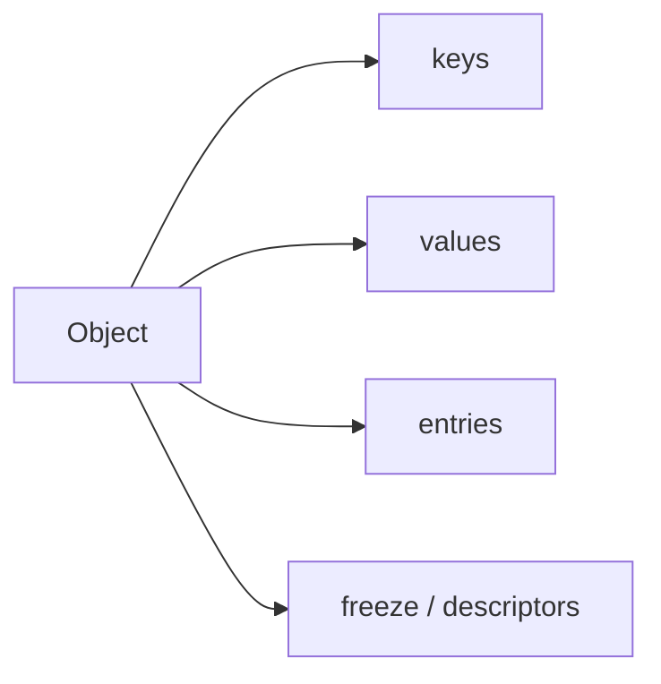

# SEC-02: Object Utilities (The Control Panel)

> **"Setelah objek terbentuk, kita butuh panel kontrol untuk membaca, membekukan, dan menginspeksi isinya dengan cepat."**

## Source Hub
- [MDN Web Docs - Object.keys()](https://developer.mozilla.org/en-US/docs/Web/JavaScript/Reference/Global_Objects/Object/keys)
- [MDN Web Docs - Object.values()](https://developer.mozilla.org/en-US/docs/Web/JavaScript/Reference/Global_Objects/Object/values)
- [MDN Web Docs - Object.entries()](https://developer.mozilla.org/en-US/docs/Web/JavaScript/Reference/Global_Objects/Object/entries)

## Formal Definition
Utilitas statis `Object` membantu menginspeksi atau mengatur perilaku objek tanpa harus membuat helper terpisah.

## Mental Model
Bayangkan panel kontrol yang bisa menampilkan daftar kunci, daftar nilai, atau pasangan lengkap dari isi gudang.

## Mekanisme Praktis
- `Object.keys()` untuk daftar kunci.
- `Object.values()` untuk daftar nilai.
- `Object.entries()` untuk iterasi pasangan.
- `Object.freeze()` untuk mengunci objek pada skenario tertentu.

## Arsitek Mindset
- Gunakan utilitas ini untuk inspeksi dan transformasi ringan.
- Jika kebutuhan mutasi dan kontrol makin kompleks, dokumentasikan aturan objeknya dengan jelas.

## Lab Praktis
Lihat utilitas objek di [object_deep_dive.js](../examples/object_deep_dive.js).

---
*Status: [status.md](../../../status.md)*
