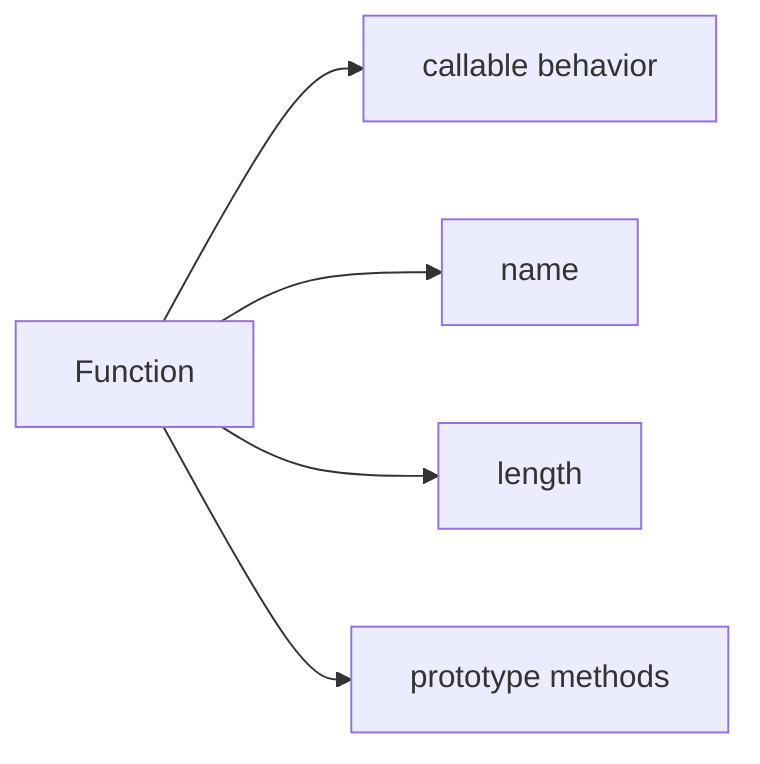

# SEC-01: Function as Object (The Dynamic Engine)

> **"Di JavaScript, fungsi bukan hanya blok kode yang bisa dipanggil. Ia juga sebuah objek dengan properti dan perilaku bawaan."**

## Source Hub
- [MDN Web Docs - Function](https://developer.mozilla.org/en-US/docs/Web/JavaScript/Reference/Global_Objects/Function)
- [MDN Web Docs - Functions](https://developer.mozilla.org/en-US/docs/Web/JavaScript/Guide/Functions)

## Formal Definition
Fungsi di JavaScript adalah callable object yang dapat disimpan, dikirim, dan memiliki properti bawaan.

## Mental Model
Bayangkan fungsi sebagai mesin dinamis yang juga punya panel informasi sendiri.

## Mekanisme Praktis
- `name` membantu identifikasi.
- `length` menunjukkan jumlah parameter deklaratif.
- Fungsi dapat diperlakukan sebagai nilai biasa.

## Arsitek Mindset
- Gunakan pengetahuan ini untuk debugging, introspeksi ringan, dan desain API yang lebih sadar konteks.
- Hindari membawa pembahasan ini kembali ke topik dasar fungsi; fokusnya di sini adalah built-in object behavior.

## Lab Praktis
Lihat properti fungsi di [function_mechanics.js](../examples/function_mechanics.js).

---
*Status: [status.md](../../../status.md)*
