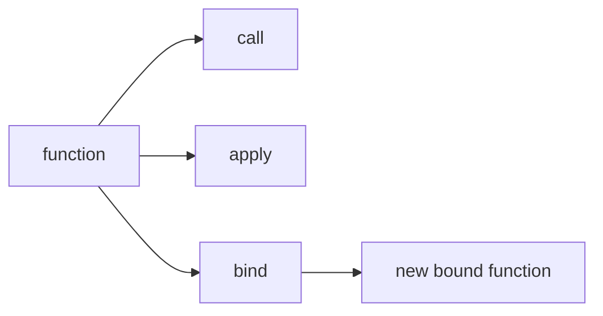

# SEC-02: Call Apply Bind (The Remote Controls)

> **"`call`, `apply`, dan `bind` adalah remote control untuk mengarahkan fungsi agar bekerja dengan konteks tertentu."**

## Source Hub
- [MDN Web Docs - Function.prototype.call()](https://developer.mozilla.org/en-US/docs/Web/JavaScript/Reference/Global_Objects/Function/call)
- [MDN Web Docs - Function.prototype.apply()](https://developer.mozilla.org/en-US/docs/Web/JavaScript/Reference/Global_Objects/Function/apply)
- [MDN Web Docs - Function.prototype.bind()](https://developer.mozilla.org/en-US/docs/Web/JavaScript/Reference/Global_Objects/Function/bind)

## Formal Definition
Metode prototipe fungsi ini mengatur bagaimana sebuah fungsi dipanggil dan nilai `this` apa yang digunakannya.

## Mental Model
Bayangkan tiga remote control: satu menjalankan langsung, satu menjalankan dengan paket argumen, dan satu lagi mengunci remote baru untuk dipakai nanti.

## Mekanisme Praktis
- `call()` untuk panggilan langsung dengan argumen terpisah
- `apply()` untuk argumen berbentuk array
- `bind()` untuk membuat fungsi baru dengan konteks tetap

## Arsitek Mindset
- Gunakan `bind()` untuk callback atau event handler saat konteks mudah hilang.
- Jangan gunakan alat ini jika konteks sebenarnya tidak perlu dipaksa.

## Lab Praktis
Lihat kontrol konteks di [function_mechanics.js](../examples/function_mechanics.js).

---
*Status: [status.md](../../../status.md)*
