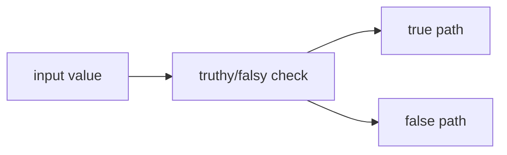

# SEC-01: Boolean Logic (The Logic Gate)

> **"`Boolean` menggerakkan banyak keputusan di JavaScript. Dua nilai kecil ini sering menentukan ke mana alur program bergerak."**

## Source Hub
- [MDN Web Docs - Boolean](https://developer.mozilla.org/en-US/docs/Web/JavaScript/Reference/Global_Objects/Boolean)
- [MDN Web Docs - Glossary: Truthy](https://developer.mozilla.org/en-US/docs/Glossary/Truthy)

## Formal Definition
`Boolean` adalah primitive dengan dua kemungkinan nilai: `true` atau `false`.

## Mental Model
Bayangkan `Boolean` sebagai gerbang logika dengan hanya dua posisi: terbuka atau tertutup.

## Mekanisme Praktis
- Banyak nilai non-boolean tetap diperlakukan sebagai truthy atau falsy.
- Bug sering muncul saat `0`, `""`, `null`, atau `undefined` tidak dipertimbangkan dengan hati-hati.

## Arsitek Mindset
- Tulis kondisi yang eksplisit bila niat logika penting.
- Jangan bergantung pada truthy/falsy jika itu membuat pembaca harus menebak maksud Anda.

## Lab Praktis
Lihat implikasi identitas dan kondisi di [identity_lab.js](../examples/identity_lab.js).

---
*Status: [status.md](../../../status.md)*
