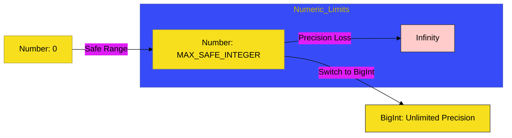

# CH-01: Number & BigInt

> **"Mekanika Numerik: Presisi Kalkulasi dari Floating-Point hingga Energi Super Besar."**

---

## 🔗 Source Hub
- **Primary Source**: [MDN Web Docs - Numbers and dates](https://developer.mozilla.org/en-US/docs/Web/JavaScript/Guide/Numbers_and_dates)
- **Technical Reference**: [ECMA-262 - Numeric Types](https://tc39.es/ecma262/#sec-numeric-types)
- **Conceptual Parent**: [BK-01 Primitive Mechanics](../README.md)

---

## 🌓 1. Essence: The Logic
Angka di JavaScript bukan sekadar digit; ia adalah representasi **Daya Kalkulasi**. Di **CH-01**, kita membedah mekanisme internal bagaimana JavaScript menangani angka melalui standar IEEE 754 (Double Precision) dan bagaimana **BigInt** (`n`) hadir untuk menangani energi angka yang luar biasa besar di luar batas aman *Number*.

Memahami batasan presisi numerik memungkinkan Anda membangun sistem finansial atau kalkulasi saintifik yang akurat, menghindari kesalahan pembulatan yang bisa melumpuhkan integritas Hub aplikasi Anda.

---

## 🎨 2. Visual Logic: The Numeric Precision Scale
Mekanisme rentang presisi antara Number standar dan BigInt:

---

## 🏛️ 3. Sections Atlas
- **[SEC-01: Number Properties](./SEC-01_NumberProperties/)**: Membedah batasan konstanta numerik seperti `MAX_VALUE` dan `EPSILON`.
- **[SEC-02: Number Methods](./SEC-02_NumberMethods/)**: Meninjau alat manipulasi angka (Parsing, Formatting, Checking).
- **[SEC-03: BigInt Pulse](./SEC-03_BigIntPulse/)**: Menjelaskan mekanisme penanganan angka super besar untuk presisi absolut.

---

## 🧪 4. The Lab (Numeric Lab)
Uji ketajaman kalkulasi dan batas presisi numerik di laboratorium:
- `../examples/numeric_precision_demo.js`

---

## ⚠️ 5. Common Pitfalls & Myths
- **Mitos**: *"Semua angka di JavaScript adalah integer."* (Salah, secara internal JavaScript memperlakukan semua `Number` sebagai **floating-point 64-bit**. Inilah alasan mengapa `0.1 + 0.2` tidak tepat sama dengan `0.3`).
- **Mitos**: *"BigInt bisa dicampur langsung dengan Number."* (Faktanya, Anda **tidak bisa** melakukan operasi matematika langsung antara BigInt dan Number; Anda harus melakukan konversi tipe data secara eksplisit agar engine tidak mematikan sirkuit aplikasi).

---
*Back to [Primitive Mechanics](../README.md)*
