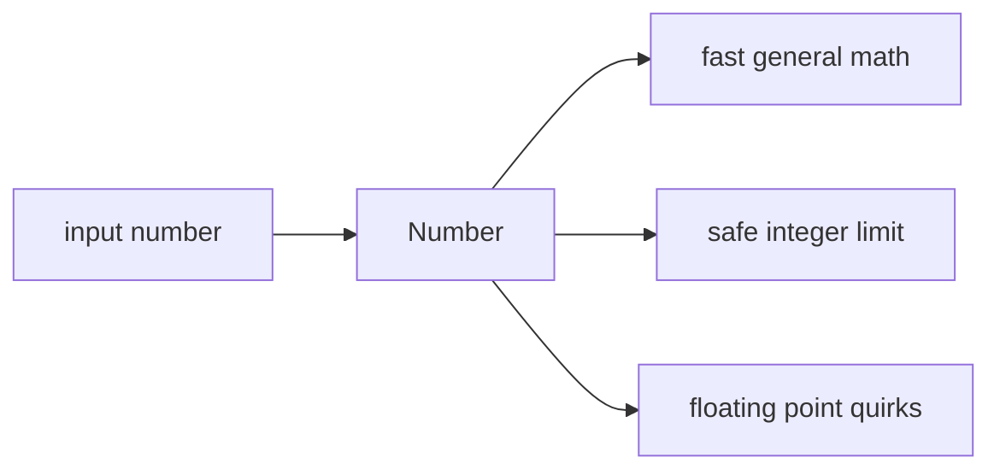

# SEC-01: Number Basics (The Precision Sensor)

> **"`Number` adalah alat numerik default JavaScript. Ia cepat dan fleksibel, tetapi punya batas aman yang perlu dipahami agar hasil perhitungan tidak mengejutkan."**

## Source Hub
- [MDN Web Docs - Number](https://developer.mozilla.org/en-US/docs/Web/JavaScript/Reference/Global_Objects/Number)
- [MDN Web Docs - Numbers and dates](https://developer.mozilla.org/en-US/docs/Web/JavaScript/Guide/Numbers_and_dates)

## Formal Definition
`Number` adalah tipe numerik utama JavaScript yang merepresentasikan angka dalam format floating point.

## Mental Model
Bayangkan `Number` sebagai sensor presisi umum: cepat dan cukup untuk hampir semua kebutuhan, tetapi punya batas saat angka terlalu besar atau presisi desimal terlalu sensitif.



## Mekanisme Praktis
- `Number.MAX_SAFE_INTEGER` menandai batas integer aman.
- Operasi desimal seperti `0.1 + 0.2` bisa memunculkan artefak presisi.

```javascript
const maxSafe = Number.MAX_SAFE_INTEGER;
console.log(maxSafe + 1);
console.log(0.1 + 0.2);
```

## Arsitek Mindset
- Untuk uang dan angka sensitif, pertimbangkan scaling atau library khusus.
- Jangan anggap semua hasil desimal sebagai presisi absolut.

## Lab Praktis
Lihat eksperimen presisi di [numerical_lab.js](../examples/numerical_lab.js).

---
*Status: [status.md](../../../status.md)*
