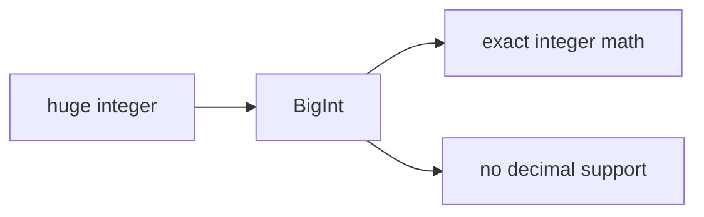

# SEC-02: BigInt Basics (The Heavy-Duty Battery)

> **"Saat integer tumbuh melampaui batas aman `Number`, `BigInt` memberi kita kapasitas tambahan tanpa kehilangan satu digit pun."**

## Source Hub
- [MDN Web Docs - BigInt](https://developer.mozilla.org/en-US/docs/Web/JavaScript/Reference/Global_Objects/BigInt)
- [MDN Web Docs - Number](https://developer.mozilla.org/en-US/docs/Web/JavaScript/Reference/Global_Objects/Number)

## Formal Definition
`BigInt` adalah tipe numerik untuk integer presisi arbitrer di JavaScript.

## Mental Model
Bayangkan `BigInt` sebagai baterai berat: tidak cocok untuk semua situasi, tetapi sangat penting saat muatan integer terlalu besar untuk sistem biasa.



## Mekanisme Praktis
- Buat `BigInt` dengan akhiran `n` atau `BigInt(...)`.
- Jangan campur `BigInt` dan `Number` tanpa konversi eksplisit.

```javascript
const megaPower = 9007199254740991n;
console.log(megaPower + 2n);
```

## Arsitek Mindset
- Gunakan `BigInt` untuk ID besar, kriptografi, atau counter integer ekstrem.
- Hindari jika kebutuhan Anda masih nyaman ditangani `Number`.

## Lab Praktis
Eksperimen integer besar ada di [numerical_lab.js](../examples/numerical_lab.js).

---
*Status: [status.md](../../../status.md)*
