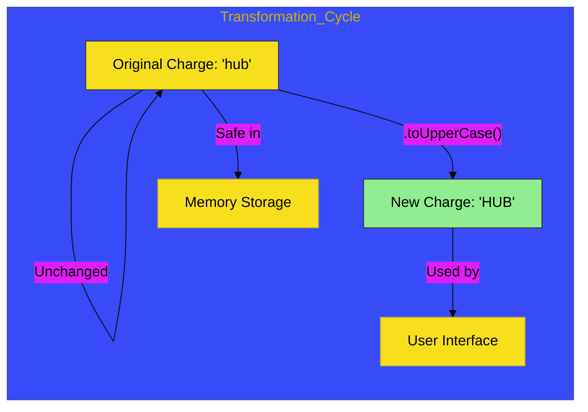

# CH-02: String Mechanics

> **"Mekanika Teks: Transformasi Aliran Karakter di Dalam Ekosistem Statis."**

---

## 🔗 Source Hub
- **Primary Source**: [MDN Web Docs - Text processing](https://developer.mozilla.org/en-US/docs/Web/JavaScript/Guide/Text_processing)
- **Technical Reference**: [ECMA-262 - String Objects](https://tc39.es/ecma262/#sec-string-objects)
- **Conceptual Parent**: [BK-01 Primitive Mechanics](../README.md)

---

## 🌓 1. Essence: The Logic
Dalam arsitektur JavaScript, teks bukan hanya sekadar label; ia adalah **Aliran Karakter**. Di **CH-02**, kita membedah mekanisme internal bagaimana string dikelola sebagai unit data yang bersifat **Immutable** (tidak dapat diubah setelah diciptakan). Setiap operasi manipulasi teks sebenarnya menciptakan "Salinan Energi" baru dengan transformasi yang diinginkan.

Memahami sifat imutabilitas ini memungkinkan Anda membangun Hub aplikasi yang efisien, di mana manipulasi memori dilakukan secara sadar, terutama saat menangani ribuan Baris Teks atau Label Data secara kinetik.

---

## 🎨 2. Visual Logic: The String Transformation Flow
Mekanisme pengolahan dan transformasi data teks (Immutability):

---

## 🏛️ 3. Sections Atlas
- **[SEC-01: String Foundations](./SEC-01_StringFoundations/)**: Membedah teknik pembungkusan karakter dan penggunaan Template Literals.
- **[SEC-02: String Methods](./SEC-01_StringMethods/)**: Meninjau instrumen manipulasi (Slice, Split, Replace, Trim).
- **[SEC-03: Case & Search](./SEC-02_StringMethods/)**: Menjelaskan teknik pencarian dan transformasi kasus karakter.

---

## 🧪 4. The Lab (String Lab)
Uji ketajaman manipulasi dan transformasi teks di laboratorium:
- `../examples/string_mechanics_demo.js`

---

## ⚠️ 5. Common Pitfalls & Myths
- **Mitos**: *"Mengubah satu karakter di string akan langsung menggantinya di memori."* (Salah, karena string bersifat **Immutable**, Anda tidak bisa melakukan `str[0] = 'H'`. Anda harus membuat string baru melalui penambahan atau metode manipulasi).
- **Mitos**: *"Template Literals (` `) hanyalah pengganti tanda kutip."* (Faktanya, Template Literals memberikan kemampuan **Interpolasi Energi** yang kuat, memungkinkan penyisipan variabel secara langsung di dalam aliran teks tanpa pemutusan sirkuit).

---
*Back to [Primitive Mechanics](../README.md)*
