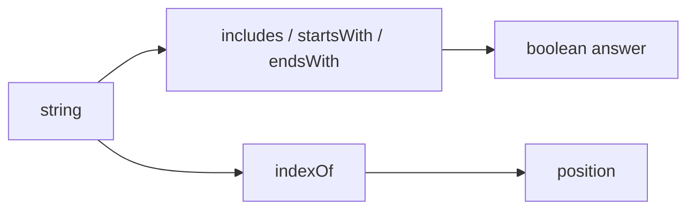

# SEC-01: Search and Inspection (The Locator Panel)

> **"Sebelum membedah teks, kita harus tahu di mana pola tertentu berada dan apakah pesan yang kita cari benar-benar ada."**

## Source Hub
- [MDN Web Docs - String instance methods](https://developer.mozilla.org/en-US/docs/Web/JavaScript/Reference/Global_Objects/String#instance_methods)
- [MDN Web Docs - String.prototype.includes()](https://developer.mozilla.org/en-US/docs/Web/JavaScript/Reference/Global_Objects/String/includes)

## Formal Definition
Metode pencarian string membantu kita memeriksa keberadaan substring, posisi, atau bentuk awal-akhir teks.

## Mental Model
Bayangkan panel locator yang memindai pesan dan memberi tahu apakah sinyal tertentu muncul, dimulai dari mana, dan berhenti di mana.

## Mekanisme Praktis
- `includes()` untuk cek keberadaan.
- `startsWith()` dan `endsWith()` untuk pola di tepi string.
- `indexOf()` untuk koordinat awal kemunculan.

## Arsitek Mindset
- Gunakan metode ini untuk validasi ringan sebelum masuk ke transformasi.
- Untuk pola kompleks, pertimbangkan regex; untuk pola sederhana, string methods biasanya lebih terbaca.

## Lab Praktis
Pola pencarian dasar dapat diamati di [string_methods_lab.js](../examples/string_methods_lab.js).

---
*Status: [status.md](../../../status.md)*
