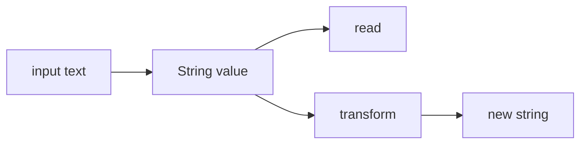

# SEC-01: String Basics (The Message Stream)

> **"Setiap pesan, perintah, dan log di Hub Energi bergerak dalam bentuk string. Memahami sifat dasarnya adalah syarat sebelum kita mulai membedah teks dengan metode yang lebih canggih."**

## Source Hub
- [MDN Web Docs - String](https://developer.mozilla.org/en-US/docs/Web/JavaScript/Reference/Global_Objects/String)
- [MDN Web Docs - String primitives and String objects](https://developer.mozilla.org/en-US/docs/Web/JavaScript/Reference/Global_Objects/String#string_primitives_and_string_objects)

## Formal Definition
String adalah urutan karakter yang dipakai JavaScript untuk merepresentasikan data teks.

## Mental Model
Bayangkan string sebagai aliran pesan yang sudah dikirim. Anda bisa membaca atau memprosesnya, tetapi tidak mengubah pesan lama di tempat yang sama.



## Mekanisme Praktis
- String bersifat **immutable**: operasi seperti `replace()` atau `toUpperCase()` menghasilkan string baru.
- Karakter bisa diakses per indeks, tetapi bukan untuk mutasi langsung.

```javascript
let msg = "Hub-01";
msg[0] = "X";
console.log(msg); // "Hub-01"
```

## Arsitek Mindset
- Waspadai biaya pembuatan string baru bila manipulasi teks dilakukan sangat sering.
- Gunakan string sebagai bentuk akhir yang stabil untuk display, log, dan payload teks.

## Lab Praktis
Lihat dasar message formatting di [string_foundations.js](../examples/string_foundations.js).

---
*Status: [status.md](../../../status.md)*
