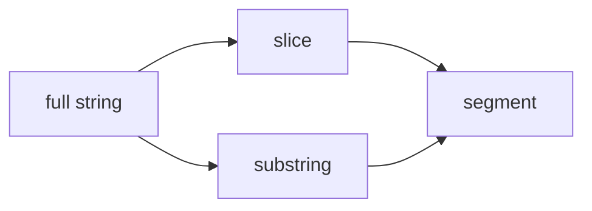

# SEC-02: Slicing and Extraction (The Precision Cutter)

> **"Terkadang kita tidak butuh seluruh pesan, hanya sebagian kecil yang relevan. Di situlah operasi pemotongan string menjadi penting."**

## Source Hub
- [MDN Web Docs - String.prototype.slice()](https://developer.mozilla.org/en-US/docs/Web/JavaScript/Reference/Global_Objects/String/slice)
- [MDN Web Docs - String.prototype.substring()](https://developer.mozilla.org/en-US/docs/Web/JavaScript/Reference/Global_Objects/String/substring)

## Formal Definition
Metode slicing memungkinkan kita mengambil sebagian string berdasarkan rentang indeks tertentu.

## Mental Model
Bayangkan pemotong presisi yang hanya mengambil segmen pesan yang dibutuhkan tanpa menyentuh bagian lain.



## Mekanisme Praktis
- `slice(start, end)` lebih fleksibel dan mendukung indeks negatif.
- `substring(start, end)` berguna juga, tetapi perilakunya berbeda pada indeks negatif.

```javascript
let log = "ERROR: Hub Overload";
let status = log.slice(0, 5); // "ERROR"
```

## Arsitek Mindset
- Jadikan `slice()` pilihan default Anda jika tidak ada alasan khusus memakai `substring()`.
- Beri nama variabel hasil ekstraksi dengan jelas agar maksud potongan teks mudah dipahami.

## Lab Praktis
Contoh pemotongan pesan bisa dilihat di [string_methods_lab.js](../examples/string_methods_lab.js).

---
*Status: [status.md](../../../status.md)*
