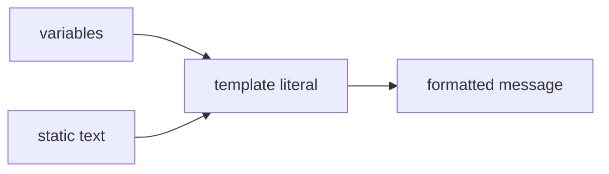

# SEC-02: Template Literals (The Structured Message Builder)

> **"Saat pesan menjadi dinamis, kita butuh cara yang lebih rapi daripada menyambung string dengan operator `+` terus-menerus. Template literals memberi kita bentuk modern untuk merakit pesan."**

## Source Hub
- [MDN Web Docs - Template literals](https://developer.mozilla.org/en-US/docs/Web/JavaScript/Reference/Template_literals)
- [MDN Web Docs - String](https://developer.mozilla.org/en-US/docs/Web/JavaScript/Reference/Global_Objects/String)

## Formal Definition
Template literals adalah sintaks string berbasis backticks yang mendukung interpolasi ekspresi dan teks multi-baris.

## Mental Model
Bayangkan template literals sebagai panel perakit pesan yang bisa langsung menyisipkan nilai dinamis ke dalam kalimat final.



## Mekanisme Praktis
- Gunakan `${...}` untuk menyisipkan ekspresi.
- Gunakan backticks untuk teks multi-baris tanpa `\n` manual.

```javascript
const hubName = "Alpha";
const status = `Status Hub ${hubName}:
- Power: Active
- Load: Stable`;
```

## Arsitek Mindset
- Template literals sangat cocok untuk log, laporan, dan format output yang melibatkan banyak nilai.
- Jangan berlebihan; jika string sangat kompleks, pertimbangkan helper function agar format tetap terbaca.

## Lab Praktis
Contoh perakitan laporan ada di [string_foundations.js](../examples/string_foundations.js).

---
*Status: [status.md](../../../status.md)*
