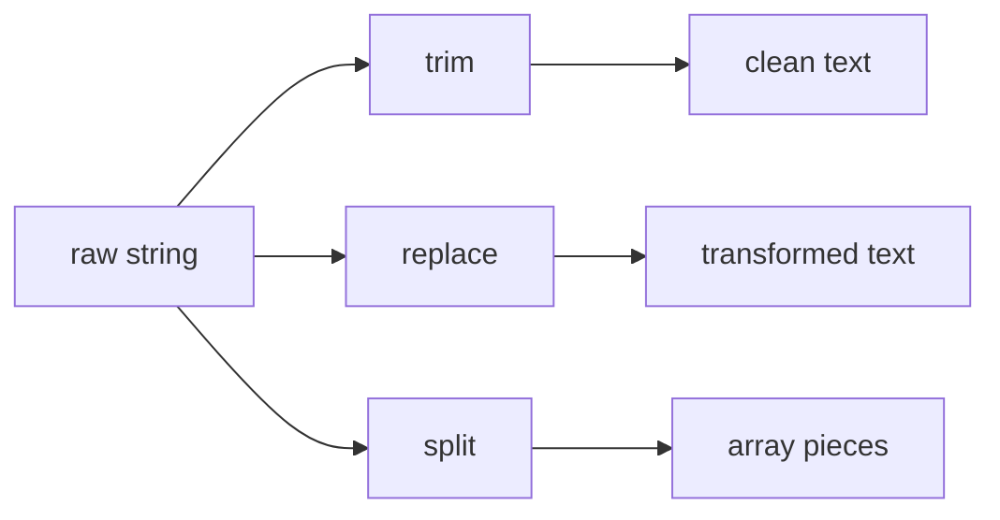

# SEC-03: Cleaning and Transformation (The Repair Bench)

> **"Setelah teks ditemukan dan dipotong, langkah berikutnya sering kali adalah membersihkan atau mengubahnya ke format yang lebih berguna."**

## Source Hub
- [MDN Web Docs - String.prototype.replace()](https://developer.mozilla.org/en-US/docs/Web/JavaScript/Reference/Global_Objects/String/replace)
- [MDN Web Docs - String.prototype.trim()](https://developer.mozilla.org/en-US/docs/Web/JavaScript/Reference/Global_Objects/String/trim)
- [MDN Web Docs - String.prototype.split()](https://developer.mozilla.org/en-US/docs/Web/JavaScript/Reference/Global_Objects/String/split)

## Formal Definition
Metode transformasi string memungkinkan kita membersihkan noise, mengganti bagian tertentu, dan memecah pesan menjadi bentuk baru.

## Mental Model
Bayangkan bangku reparasi teks: bagian kotor dibersihkan, label lama diganti, dan pesan panjang dipecah menjadi unit-unit yang lebih mudah diproses.



## Mekanisme Praktis
- `trim()` untuk membersihkan spasi tepi.
- `replace()` untuk transformasi langsung, termasuk pola regex.
- `split()` untuk memecah string menjadi array.

```javascript
let rawData = "  Alpha-01:Active  ";
let cleanData = rawData.trim().toUpperCase().replace("-", "_");
```

## Arsitek Mindset
- Method chaining efektif, tetapi tetap jaga agar tiap langkah masih mudah dibaca.
- Jika transformasi makin panjang, pecah ke beberapa langkah bernama.

## Lab Praktis
Lihat alur pembersihan log di [string_methods_lab.js](../examples/string_methods_lab.js).

---
*Status: [status.md](../../../status.md)*
