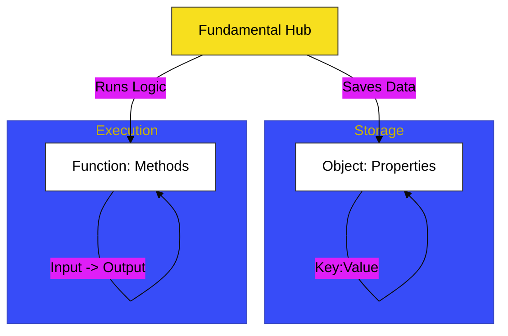

# CH-03: Object & Function Foundations

> **"Unit Arsitektural: Membedah Struktur Data dan Logika Mandiri."**

---

## 🔗 Source Hub
- **Primary Source**: [MDN Web Docs - Objects](https://developer.mozilla.org/en-US/docs/Web/JavaScript/Guide/Working_with_Objects)
- **Technical Reference**: [ECMA-262 - Ordinary Object Internal Methods](https://tc39.es/ecma262/#sec-ordinary-object-internal-methods-and-internal-slots)
- **Conceptual Parent**: [BK-01 Primitive Mechanics](../README.md)

---

## 🌓 1. Essence: The Logic
Dalam arsitektur JavaScript, hampir segala sesuatu adalah objek. Di **CH-03**, kita membedah mekanisme internal bagaimana **Objects** menyimpan data melalui pasangan kunci-nilai (*key-value pairs*) dan bagaimana **Functions** bertindak sebagai objek khusus yang memiliki kemampuan operasional.

Memahami hubungan mendalam ini memungkinkan Anda membangun unit aplikasi yang terorganisir, di mana data dikapsulasi di dalam objek dan logika dijalankan melalui fungsi, sehingga tercipta sistem yang modular dan kohesif.

---

## 🎨 2. Visual Logic: The Fundamental Unit Logic
Mekanisme interaksi antara unit data dan unit logika:

---

## 🏛️ 3. Sections Atlas
- **[SEC-01: Object Foundations](./SEC-01_Object/)**: Membedah teknik pembungkusan data dan akses properti.
- **[SEC-02: Function as Object](./SEC-01_FunctionAsObject/)**: Meninjau bagaimana fungsi memiliki sifat objek di JavaScript.
- **[SEC-03: Static Methods](./SEC-02_ObjectMethods/)**: Menjelaskan utilitas bawaan untuk manipulasi objek secara massal.

---

## 🧪 4. The Lab (Unit Lab)
Uji ketajaman perakitan objek dan fungsi di laboratorium:
- `../examples/object_function_demo.js`

---

## ⚠️ 5. Common Pitfalls & Myths
- **Mitos**: *"Objek dan Fungsi adalah dua hal yang berbeda secara total."* (Salah, di JavaScript, **Functions are Objects**. Fungsi dapat memiliki properti dan metode sendiri, memberikan fleksibilitas arsitektural yang unik).
- **Mitos**: *"Mengakses properti objek yang tidak ada akan menyebabkan error."* (Faktanya, JavaScript akan mengembalikan **`undefined`** tanpa mematikan sirkuit aplikasi. Error hanya terjadi jika Anda mencoba mengakses properti dari sesuatu yang bernilai `null` atau `undefined`).

---
*Back to [Primitive Mechanics](../README.md)*
