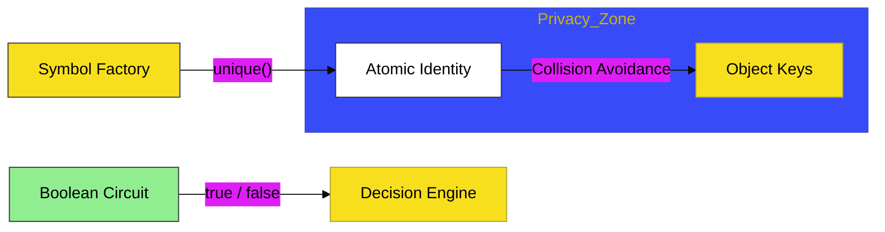

# CH-04: Boolean & Symbol

> **"Sinyal & Identitas: Membedah Logika Biner dan Keunikan Atomik."**

---

## 🔗 Source Hub
- **Primary Source**: [MDN Web Docs - Boolean](https://developer.mozilla.org/en-US/docs/Web/JavaScript/Reference/Global_Objects/Boolean)
- **Technical Reference**: [ECMA-262 - Symbols](https://tc39.es/ecma262/#sec-symbol-objects)
- **Conceptual Parent**: [BK-01 Primitive Mechanics](../README.md)

---

## 🌓 1. Essence: The Logic
Dalam arsitektur JavaScript, keputusan dibuat melalui sinyal biner. **Boolean** di **CH-04** membedah bagaimana nilai `true` dan `false` menggerakkan sirkuit logika. Di sisi lain, **Symbol** hadir sebagai tipe data primitif yang memberikan **Identitas Unik** yang tidak pernah bisa diduplikasi, bahkan jika memiliki deskripsi yang sama.

Memahami kontras ini memungkinkan Anda membangun gerbang logika yang presisi dan mengelola kunci objek yang aman dari tabrakan data (*collision avoidance*) di dalam Hub aplikasi yang kompleks.

---

## 🎨 2. Visual Logic: The Logic & Identity Pulse
Mekanisme pengolahan sinyal dan penciptaan identitas unik:

---

## 🏛️ 3. Sections Atlas
- **[SEC-01: Boolean Logic](./SEC-01_BooleanSymbol/)**: Membedah teknik evaluasi kebenaran (*Truthy/Falsy*) dan konversi sinyal.
- **[SEC-02: Working with Symbols](./SEC-02_SymbolPatterns/)**: Meninjau penggunaan Symbol sebagai kunci properti yang terisolasi.
- **[SEC-03: Well-Known Symbols](./SEC-02_SymbolPatterns/)**: Menjelaskan simbol bawaan sistem yang mengontrol perilaku objek internal.

---

## 🧪 4. The Lab (Signal Lab)
Uji ketajaman evaluasi sinyal dan keunikan identitas di laboratorium:
- `../examples/boolean_symbol_demo.js`

---

## ⚠️ 5. Common Pitfalls & Myths
- **Mitos**: *"Setiap objek yang tidak memiliki data adalah `false`."* (Salah, di JavaScript, objek literal kosong `{}` atau array kosong `[]` tetap bernilai **`true`** secara logika. Hanya `null`, `undefined`, `0`, `NaN`, dan `""` yang bernilai `false`).
- **Mitos**: *"Symbol bisa dikonversi secara otomatis menjadi string."* (Faktanya, engine JavaScript melarang konversi implisit antara Symbol dan String untuk menjaga integritas identitas; Anda harus melakukan konversi manual demi keamanan sirkuit).

---
*Back to [Primitive Mechanics](../README.md)*
