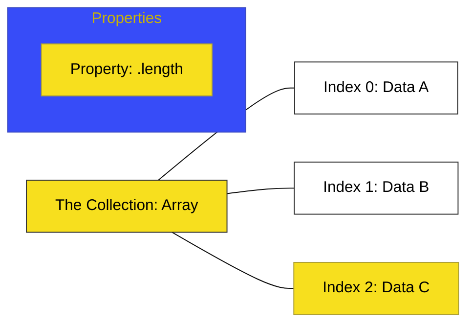

# CH-01: Array Foundations

> **"Sistem Koleksi: Fondasi Penyimpanan Data Berurutan dalam Struktur Linear."**

---

## 🔗 Source Hub
- **Primary Source**: [MDN Web Docs - Indexed collections](https://developer.mozilla.org/en-US/docs/Web/JavaScript/Guide/Indexed_collections)
- **Technical Reference**: [ECMA-262 - Array Objects](https://tc39.es/ecma262/#sec-array-objects)
- **Conceptual Parent**: [BK-02 Collection Hubs](../README.md)

---

## 🌓 1. Essence: The Logic
Dalam arsitektur data, kita sering membutuhkan cara untuk menyimpan daftar item yang teratur. **Arrays** di **CH-01** membedah bagaimana JavaScript menyediakan koleksi berindeks nol yang dinamis. Array bukan hanya sebuah daftar; ia adalah objek khusus yang dioptimalkan untuk akses cepat ke elemen berdasarkan posisi numeriknya.

Memahami bagaimana **Array Foundations** bekerja memungkinkan Anda mengelola data masif secara terorganisir, di mana setiap elemen memiliki alamat (indeks) yang jelas di dalam Hub aplikasi Anda.

---

## 🎨 2. Visual Logic: The Collection Lattice
Mekanisme penyimpanan dan pengalamatan data secara linear:

---

## 🏛️ 3. Sections Atlas
- **[SEC-01: Creating Arrays](./SEC-01_ArrayFoundations/)**: Membedah teknik inisialisasi koleksi (Literal vs Constructor).
- **[SEC-02: Array Access](./SEC-01_ArrayFoundations/)**: Meninjau cara membaca dan mengubah data menggunakan alamat indeks.
- **[SEC-03: Array Instance](./SEC-01_ArrayFoundations/)**: Menjelaskan properti internal yang melacak kuantitas data di dalam koleksi.

---

## 🧪 4. The Lab (Collection Lab)
Uji ketajaman penyimpanan dan akses data linear di laboratorium:
- `../examples/array_foundations_demo.js`

---

## ⚠️ 5. Common Pitfalls & Myths
- **Mitos**: *"Array adalah tipe data primitif tersendiri."* (Salah, di JavaScript, `typeof []` akan mengembalikan **`"object"`**. Array adalah objek khusus dengan perilaku yang dioptimalkan untuk indeks numerik dan pelacakan panjang data).
- **Mitos**: *"Anda harus menentukan ukuran array sebelum mengisinya."* (Faktanya, Array di JavaScript bersifat **Dinamis**; ia akan secara otomatis meluas saat Anda menambahkan data baru, memberikan fleksibilitas tanpa perlu deklarasi ukuran awal).

---
*Back to [Collection Hubs](../README.md)*
