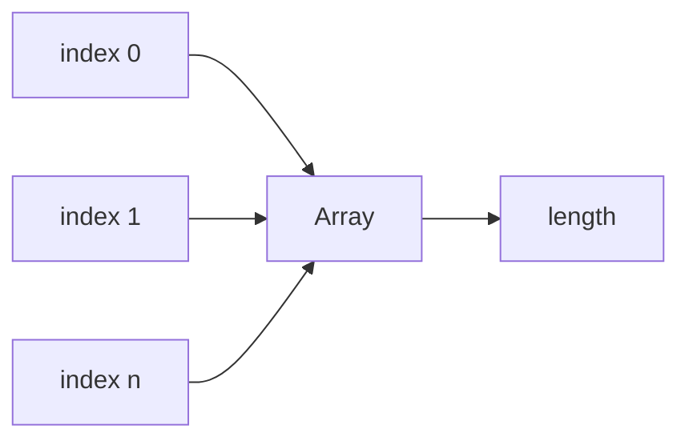

# SEC-01: Array Basics (The Transport Rail)

> **"`Array` adalah rel transportasi utama untuk data berurutan di JavaScript."**

## Source Hub
- [MDN Web Docs - Array](https://developer.mozilla.org/en-US/docs/Web/JavaScript/Reference/Global_Objects/Array)
- [MDN Web Docs - Indexed collections](https://developer.mozilla.org/en-US/docs/Web/JavaScript/Guide/Indexed_collections)

## Formal Definition
`Array` adalah objek berindeks numerik yang menyimpan elemen dalam urutan tertentu.

## Mental Model
Bayangkan array sebagai rangkaian gerbong bernomor yang membawa data satu per satu.

## Mekanisme Praktis
- Indeks dimulai dari `0`.
- `.length` membantu mengetahui ukuran koleksi.
- Array tetap objek, hanya saja dengan perilaku khusus untuk indeks numerik.

## Arsitek Mindset
- Gunakan array saat Anda butuh urutan stabil.
- Jangan perlakukan array sebagai map berkunci bebas.

## Lab Praktis
Lihat fondasi array di [array_foundations_lab.js](../examples/array_foundations_lab.js).

---
*Status: [status.md](../../../status.md)*
