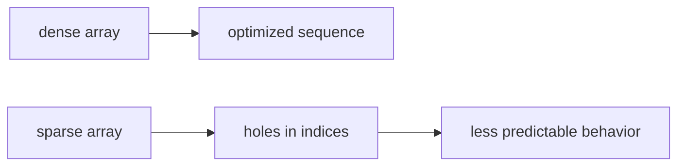

# SEC-02: Sparse vs Dense Arrays (The Gap Problem)

> **"Tidak semua array punya kualitas yang sama. Array yang rapat dan array yang berlubang bisa diperlakukan sangat berbeda oleh mesin JavaScript."**

## Source Hub
- [MDN Web Docs - Array](https://developer.mozilla.org/en-US/docs/Web/JavaScript/Reference/Global_Objects/Array)
- [MDN Web Docs - Indexed collections](https://developer.mozilla.org/en-US/docs/Web/JavaScript/Guide/Indexed_collections)

## Formal Definition
Dense array berisi elemen yang tersusun rapat, sedangkan sparse array memiliki indeks kosong di tengah urutan.

## Mental Model
Bayangkan rel transportasi dengan gerbong lengkap versus rel yang punya lubang kosong di tengah-tengah.

## Mekanisme Praktis
- Sparse array sering muncul saat Anda melompati indeks tinggi secara langsung.
- Perilaku iterasi dan performanya bisa berbeda dibanding array rapat.

## Arsitek Mindset
- Hindari sparse array jika tidak ada alasan yang sangat jelas.
- Jika struktur data Anda memang tidak berurutan rapat, pertimbangkan objek atau map.

## Lab Praktis
Perbandingan dense dan sparse ada di [array_foundations_lab.js](../examples/array_foundations_lab.js).

---
*Status: [status.md](../../../status.md)*
