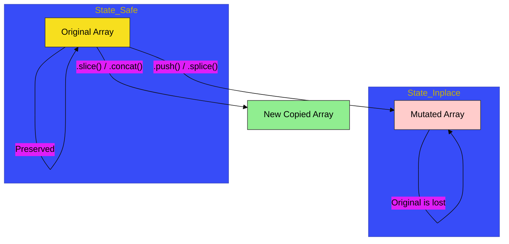

# CH-02: Array Modification

> **"Modifikasi Koleksi: Mengatur Aliran Data Melalui Mutasi dan Transformasi."**

---

## 🔗 Source Hub
- **Primary Source**: [MDN Web Docs - Array Methods](https://developer.mozilla.org/en-US/docs/Web/JavaScript/Reference/Global_Objects/Array#instance_methods)
- **Technical Reference**: [ECMA-262 - Array.prototype.splice](https://tc39.es/ecma262/#sec-array.prototype.splice)
- **Conceptual Parent**: [BK-02 Collection Hubs](../README.md)

---

## 🌓 1. Essence: The Logic
Koleksi data jarang bersifat statis. Di **CH-02**, kita membedah mekanisme internal bagaimana kita menambah, menghapus, dan memodifikasi elemen di dalam sebuah array secara kinetik.

Pemahaman mendalam tentang perbedaan antara **Mutating Methods** (yang mengubah sirkuit asli) dan **Non-Mutating Methods** (yang menghasilkan sirkuit baru) sangat krusial bagi arsitek Hub untuk menjaga integritas data dan mencegah kebocoran status yang tidak disengaja.

---

## 🎨 2. Visual Logic: Mutation vs Transformation Flow
Mekanisme pengolahan data koleksi (In-place vs Copy):

---

## 🏛️ 3. Sections Atlas
- **[SEC-01: Adding & Removing](./SEC-01_ArrayModification/)**: Membedah teknik dasar manipulasi ujung koleksi (Push, Pop, Shift, Unshift).
- **[SEC-02: Splice & Slice](./SEC-02_ArrayModification/)**: Meninjau instrumen pemotong dan penyambung data secara presisi.
- **[SEC-03: Joining & Reversing](./SEC-02_ArrayModification/)**: Menjelaskan transformasi urutan dan penggabungan aliran data.

---

## 🧪 4. The Lab (Modification Lab)
Uji ketajaman mutasi dan transformasi koleksi di laboratorium:
- `../examples/array_modification_demo.js`

---

## ⚠️ 5. Common Pitfalls & Myths
- **Mitos**: *"Metode `.push()` akan menghasilkan array baru."* (Salah, `.push()` adalah **Mutating Method** yang mengubah array asli di tempat. Jika Anda ingin mempertahankan integritas data asli, pertimbangkan untuk menggunakan spread operator `[...]`).
- **Mitos**: *"Metode `.splice()` dan `.slice()` adalah hal yang sama."* (Faktanya, satu huruf pembeda memberikan dua nasib berbeda: `splice` **memotong** sirkuit asli (Mutating), sedangkan `slice` **menyalin** sebagian sirkuit (Non-Mutating)).

---
*Back to [Collection Hubs](../README.md)*
