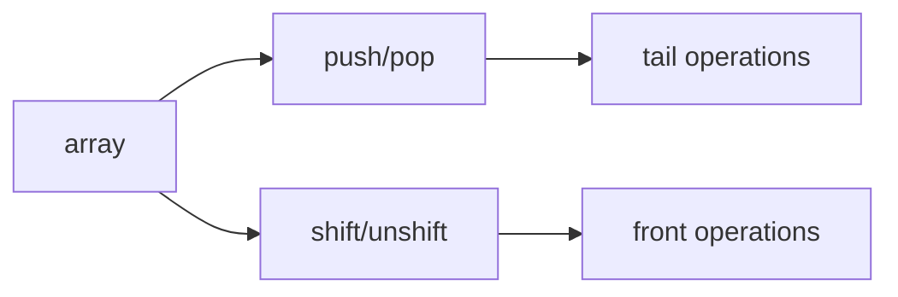

# SEC-01: Stack and Queue Operations (The Platform Edges)

> **"Ujung depan dan ujung belakang array memberi dua gaya pengelolaan koleksi yang berbeda: stack dan queue."**

## Source Hub
- [MDN Web Docs - Array.prototype.push()](https://developer.mozilla.org/en-US/docs/Web/JavaScript/Reference/Global_Objects/Array/push)
- [MDN Web Docs - Array.prototype.shift()](https://developer.mozilla.org/en-US/docs/Web/JavaScript/Reference/Global_Objects/Array/shift)

## Formal Definition
Metode stack dan queue mengubah array dari sisi belakang atau depan.

## Mental Model
Bayangkan platform stasiun: belakang lebih mudah ditambah-kurangi, depan lebih mahal karena gerbong lain ikut terdorong.

## Mekanisme Praktis
- `push/pop` biasanya lebih murah.
- `shift/unshift` memicu pergeseran indeks.

## Arsitek Mindset
- Pilih operasi berdasarkan pola akses, bukan sekadar kebiasaan.
- Jika front-ops terlalu sering, pertimbangkan struktur lain.

## Lab Praktis
Lihat perbandingan performa di [array_performance.js](../examples/array_performance.js).

---
*Status: [status.md](../../../status.md)*
