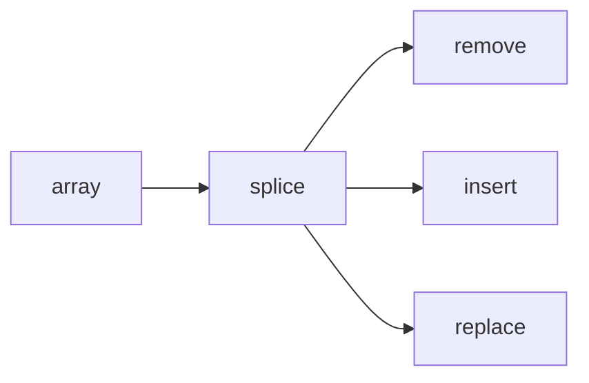

# SEC-02: Splice and In-Place Changes (The Surgery Tool)

> **"`splice()` adalah alat bedah utama untuk mutasi array di posisi mana pun."**

## Source Hub
- [MDN Web Docs - Array.prototype.splice()](https://developer.mozilla.org/en-US/docs/Web/JavaScript/Reference/Global_Objects/Array/splice)
- [MDN Web Docs - Array instance methods](https://developer.mozilla.org/en-US/docs/Web/JavaScript/Reference/Global_Objects/Array#instance_methods)

## Formal Definition
`splice()` menghapus, menyisipkan, atau mengganti elemen array secara langsung.

## Mental Model
Bayangkan operasi bedah pada rel: bagian tertentu bisa diangkat, disisipkan, atau diganti tanpa membongkar seluruh rangkaian.

## Mekanisme Praktis
- `splice(index, count)` untuk hapus
- `splice(index, 0, item)` untuk sisip
- `splice(index, 1, item)` untuk ganti

## Arsitek Mindset
- Gunakan `splice()` saat Anda memang ingin mutasi in-place.
- Dokumentasikan niat mutasi jika operasi mulai sulit dibaca.

## Lab Praktis
Lihat mutasi koleksi di [array_performance.js](../examples/array_performance.js).

---
*Status: [status.md](../../../status.md)*
