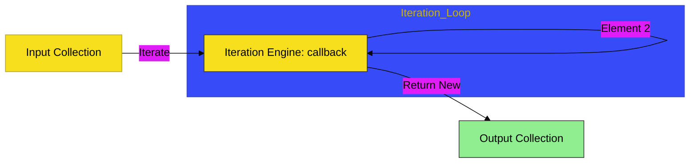

# CH-03: Array Iteration

> **"Mesin Iterasi: Pemrosesan Data Koleksi Melalui Unit Fungsional."**

---

## 🔗 Source Hub
- **Primary Source**: [MDN Web Docs - Array Methods: Iteration](https://developer.mozilla.org/en-US/docs/Web/JavaScript/Reference/Global_Objects/Array#iteration_methods)
- **Technical Reference**: [ECMA-262 - Array.prototype.map](https://tc39.es/ecma262/#sec-array.prototype.map)
- **Conceptual Parent**: [BK-02 Collection Hubs](../README.md)

---

 ## 🌓 1. Essence: The Logic
Pemrosesan data masif memerlukan efisiensi. Di **CH-03**, kita membedah mekanisme internal bagaimana kita melakukan perulangan pada elemen array menggunakan metode fungsional (seperti `.map()`, `.filter()`, dan `.reduce()`).

Pemahaman mendalam tentang **Iteration Engine** ini memungkinkan Anda mentransformasi, menyaring, dan mengakumulasi data koleksi dengan kode yang ringkas, deklaratif, dan mudah diuji, sehingga Hub aplikasi Anda tetap memiliki performa tinggi.

---

## 🎨 2. Visual Logic: The Iteration Engine Flow
Mekanisme pengolahan elemen di dalam unit iterasi fungsional:

---

## 🏛️ 3. Sections Atlas
- **[SEC-01: Functional Iteration](./SEC-01_ArrayIteration/)**: Membedah teknik dasar perulangan menggunakan `.forEach()`.
- **[SEC-02: Map & Filter](./SEC-01_ArrayIteration/)**: Meninjau instrumen transformasi dan penyaringan data koleksi.
- **[SEC-03: Reduce & Modern](./SEC-02_ArrayIteration/)**: Menjelaskan akumulasi data dan metode pencarian modern (Find, Every, Some).

---

## 🧪 4. The Lab (Iteration Lab)
Uji ketajaman pemrosesan fungsional dan akumulasi data di laboratorium:
- `../examples/array_iteration_demo.js`

---

## ⚠️ 5. Common Pitfalls & Myths
- **Mitos**: *"Metode `.forEach()` selalu lebih cepat daripada loop `for` biasa."* (Faktanya, loop `for` konvensional terkadang lebih cepat dalam hal performa engine, namun `.forEach()` jauh lebih unggul dalam hal keterbacaan dan struktur arsitektural yang bersih).
- **Mitos**: *"Metode `.map()` mengubah array asli."* (Salah, `.map()` adalah **Non-Mutating Method** yang menciptakan array baru sebagai hasil transformasi. Jika Anda ingin melakukan aksi tanpa output baru, gunakan `.forEach()`).

---
*Back to [Collection Hubs](../README.md)*
