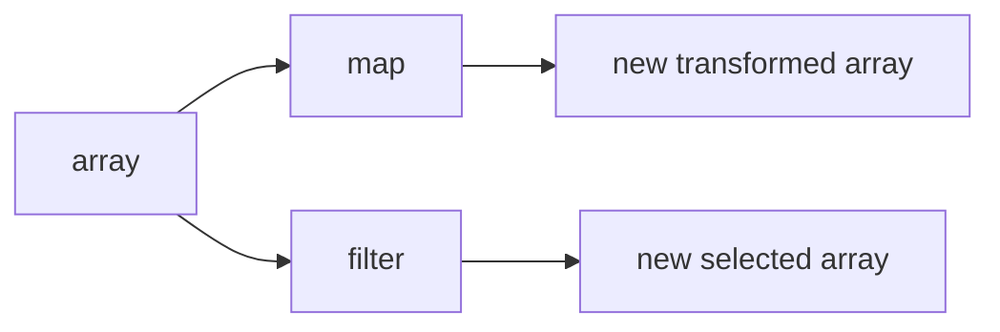

# SEC-01: Transform and Select (The Conveyor Stations)

> **"`map()` dan `filter()` adalah dua stasiun paling umum dalam sabuk konveyor pemrosesan array."**

## Source Hub
- [MDN Web Docs - Array.prototype.map()](https://developer.mozilla.org/en-US/docs/Web/JavaScript/Reference/Global_Objects/Array/map)
- [MDN Web Docs - Array.prototype.filter()](https://developer.mozilla.org/en-US/docs/Web/JavaScript/Reference/Global_Objects/Array/filter)

## Formal Definition
Metode transformasi dan seleksi menghasilkan array baru berdasarkan aturan callback tertentu.

## Mental Model
Bayangkan sabuk konveyor dengan dua stasiun: satu mengubah bentuk tiap unit, satu lagi hanya meloloskan unit yang lolos pemeriksaan.

## Mekanisme Praktis
- `map()` untuk transformasi satu-per-satu
- `filter()` untuk seleksi berbasis kondisi

## Arsitek Mindset
- Gunakan metode ini saat niat transformasi atau seleksi ingin terlihat jelas.
- Hindari callback yang terlalu rumit hingga menutupi tujuan utama.

## Lab Praktis
Lihat transformasi dan seleksi di [array_iteration_lab.js](../examples/array_iteration_lab.js).

---
*Status: [status.md](../../../status.md)*
