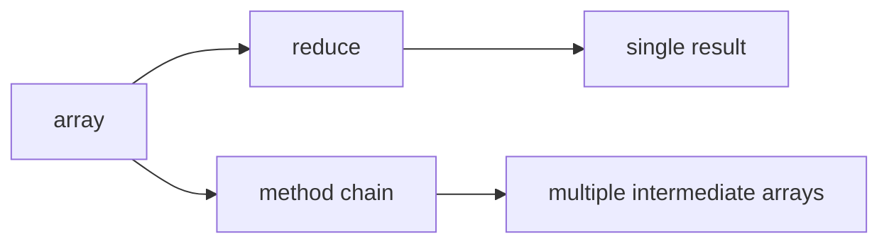

# SEC-02: Reduce and Chaining (The Aggregation Bench)

> **"`reduce()` dan chaining memberi kita daya besar, tetapi juga menuntut kejelasan berpikir agar kode tetap mudah dirawat."**

## Source Hub
- [MDN Web Docs - Array.prototype.reduce()](https://developer.mozilla.org/en-US/docs/Web/JavaScript/Reference/Global_Objects/Array/reduce)
- [MDN Web Docs - Array iterative methods](https://developer.mozilla.org/en-US/docs/Web/JavaScript/Reference/Global_Objects/Array#iterative_methods)

## Formal Definition
`reduce()` merangkum seluruh elemen array menjadi satu hasil, sementara chaining menggabungkan beberapa metode iteratif secara berurutan.

## Mental Model
Bayangkan bangku agregasi: semua unit yang lewat akhirnya dilebur menjadi satu ringkasan besar.

## Mekanisme Praktis
- `reduce()` cocok untuk total, object builder, atau agregasi kompleks.
- Chaining membantu keterbacaan, tetapi bisa menambah biaya memori.

## Arsitek Mindset
- Gunakan `reduce()` saat hasil akhirnya memang satu nilai atau satu struktur.
- Pecah rantai panjang jika mulai sulit dipahami.

## Lab Praktis
Lihat agregasi dan chaining di [array_iteration_lab.js](../examples/array_iteration_lab.js).

---
*Status: [status.md](../../../status.md)*
