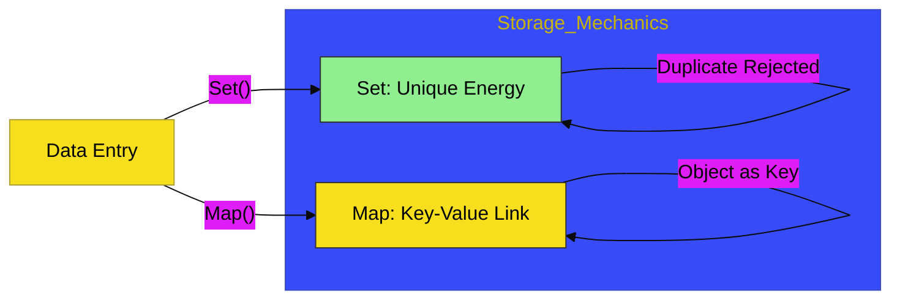

# CH-04: Keyed Collections

> **"Koleksi Berbasis Kunci: Efisiensi Penyimpanan Melalui Pemetaan Unik."**

---

## 🔗 Source Hub
- **Primary Source**: [MDN Web Docs - Keyed collections](https://developer.mozilla.org/en-US/docs/Web/JavaScript/Guide/Keyed_collections)
- **Technical Reference**: [ECMA-262 - Map Objects](https://tc39.es/ecma262/#sec-map-objects)
- **Conceptual Parent**: [BK-02 Collection Hubs](../README.md)

---

## 🌓 1. Essence: The Logic
Terkadang, array linear tidak cukup untuk kebutuhan arsitektur data kita. Di **CH-04**, kita membedah mekanisme internal **Map** (Pemetaan) dan **Set** (Himpunan). Berbeda dengan objek biasa, Map memungkinkan penggunaan tipe data apa pun sebagai kunci, dan Set menjamin bahwa setiap elemen di dalamnya adalah unik.

Memahami **Keyed Collections** memungkinkan Anda mengelola hubungan data yang kompleks dan koleksi yang bebas duplikasi dengan performa pencarian yang lebih optimal di dalam Hub aplikasi Anda.

---

## 🎨 2. Visual Logic: The Key Isolation Flow
Mekanisme pengaitan kunci ke nilai dan pemastian keunikan:

---

## 🏛️ 3. Sections Atlas
- **[SEC-01: Map & WeakMap](./SEC-04_KeyedCollections/)**: Membedah teknik pemetaan data dan manajemen memori otomatis (WeakMap).
- **[SEC-02: Set & WeakSet](./SEC-04_KeyedCollections/)**: Meninjau cara mengelola koleksi nilai unik tanpa duplikasi.
- **[SEC-03: Performance Benefits](./SEC-04_KeyedCollections/)**: Menjelaskan alasan arsitektural penggunaan Keyed Collections dibandingkan objek literal.

---

## 🧪 4. The Lab (Keyed Lab)
Uji ketajaman pemetaan unik dan manajemen memori di laboratorium:
- `../examples/map_set_demo.js`

---

## ⚠️ 5. Common Pitfalls & Myths
- **Mitos**: *"Map hanyalah objek dengan cara tulis yang berbeda."* (Salah, Map memiliki performa yang lebih baik untuk penambahan/penghapusan kunci massal dan memungkinkan penggunaan **Objek sebagai Kunci**, yang tidak mungkin dilakukan oleh objek literal biasa).
- **Mitos**: *"Set akan secara otomatis menghapus objek yang isinya sama."* (Faktanya, Set membandingkan identitas memori. Dua objek berbeda `{}` dan `{}` di memori tetap dianggap **dua unit unik** oleh Set, meskipun tampilannya sama).

---
*Back to [Collection Hubs](../README.md)*
