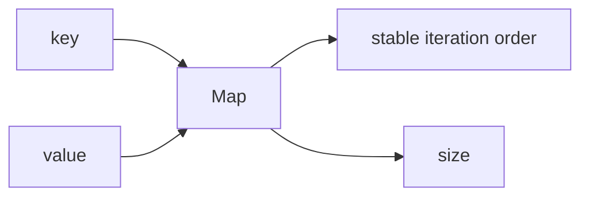

# SEC-01: Map Fundamentals (The Logistics Hub)

> **"Jika objek biasa adalah gudang sederhana, maka `Map` adalah hub logistik canggih yang mendukung kunci bertipe apa pun dengan perilaku yang lebih stabil untuk kebutuhan koleksi dinamis."**

## Source Hub
- [MDN Web Docs - Map](https://developer.mozilla.org/en-US/docs/Web/JavaScript/Reference/Global_Objects/Map)
- [MDN Web Docs - Keyed collections](https://developer.mozilla.org/en-US/docs/Web/JavaScript/Guide/Keyed_collections)

## Formal Definition
`Map` adalah koleksi pasangan kunci-nilai yang mempertahankan urutan saat data dimasukkan dan memungkinkan hampir semua tipe dipakai sebagai kunci.

## Mental Model
Bayangkan `Map` sebagai hub logistik yang bisa menerima label apa pun pada pintu gudangnya: string, angka, objek, bahkan fungsi.



## Mekanisme Praktis
- `Map` unggul saat kunci tidak terbatas pada string atau symbol.
- `.size` memberi ukuran langsung tanpa perlu menghitung manual.
- Iterasi `Map` terasa lebih konsisten saat data masuk dan keluar secara dinamis.

```javascript
const hubCapacities = new Map();
hubCapacities.set({ id: "ALPHA" }, 5000);
```

## Arsitek Mindset
- Gunakan `Map` saat struktur Anda benar-benar berperan sebagai kamus dinamis.
- Jangan memaksa `Object` menjadi pengganti `Map` jika kebutuhan kuncinya sudah lebih kompleks.

## Lab Praktis
Lihat perbandingan `Object` dan `Map` di [keyed_collections_lab.js](../examples/keyed_collections_lab.js).

---
*Status: [status.md](../../../status.md)*
