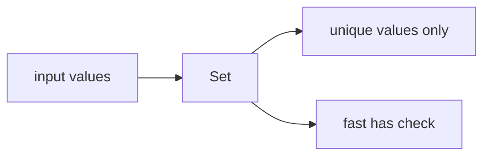

# SEC-01: Set Fundamentals (The Verification Gate)

> **"Dalam Hub Energi, terkadang kita hanya perlu memastikan sebuah unit tidak terdaftar dua kali. `Set` adalah gerbang verifikasi yang menjaga agar setiap nilai tetap unik."**

## Source Hub
- [MDN Web Docs - Set](https://developer.mozilla.org/en-US/docs/Web/JavaScript/Reference/Global_Objects/Set)
- [MDN Web Docs - Keyed collections](https://developer.mozilla.org/en-US/docs/Web/JavaScript/Guide/Keyed_collections)

## Formal Definition
`Set` adalah koleksi nilai unik yang secara otomatis menolak duplikasi.

## Mental Model
Bayangkan `Set` sebagai gerbang verifikasi ketat: jika identitas yang sama sudah pernah masuk, gerbang tidak akan mengizinkannya lagi.



## Mekanisme Praktis
- `Set` sangat berguna untuk deduplikasi array.
- `.has()` lebih cocok dipakai daripada mencari manual di array saat Anda sering memeriksa keberadaan data.

```javascript
const cleanArray = [...new Set([10, 20, 10, 30])];
```

## Arsitek Mindset
- Gunakan `Set` saat fokus Anda adalah keunikan dan keberadaan data.
- Jangan pakai array hanya karena sudah terbiasa jika kebutuhan Anda sebenarnya adalah membership check.

## Lab Praktis
Lihat deduplikasi dan membership check di [set_lab.js](../examples/set_lab.js).

---
*Status: [status.md](../../../status.md)*
