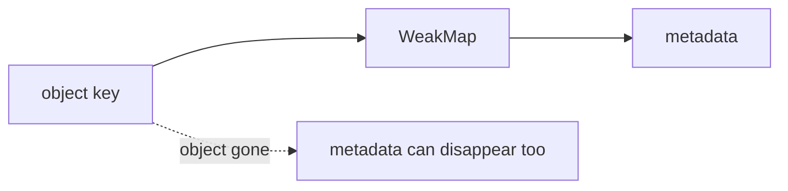

# SEC-02: WeakMap Patterns (The Hidden Metadata Channel)

> **"`WeakMap` berguna saat data tambahan perlu menempel pada objek, tetapi tidak boleh membuat objek itu tetap hidup hanya karena metadata masih tersimpan."**

## Source Hub
- [MDN Web Docs - WeakMap](https://developer.mozilla.org/en-US/docs/Web/JavaScript/Reference/Global_Objects/WeakMap)
- [MDN Web Docs - Keyed collections](https://developer.mozilla.org/en-US/docs/Web/JavaScript/Guide/Keyed_collections)

## Formal Definition
`WeakMap` adalah koleksi pasangan kunci-nilai yang hanya menerima objek sebagai kunci dan tidak mencegah objek kunci dibersihkan oleh garbage collector.

## Mental Model
Bayangkan `WeakMap` sebagai jalur metadata rahasia yang menempel pada unit fisik, tetapi ikut hilang saat unit itu benar-benar dibongkar.

## Mekanisme Praktis
- Gunakan `WeakMap` untuk metadata internal, cache ringan, atau penanda privat per objek.
- `WeakMap` tidak cocok untuk iterasi umum karena ia memang dirancang bukan sebagai koleksi yang ingin dibaca massal.

## Arsitek Mindset
- Pilih `WeakMap` saat tujuan utamanya adalah menempelkan data tambahan tanpa risiko memory leak yang tidak perlu.
- Jangan gunakan `WeakMap` jika Anda butuh enumerasi seluruh isi koleksi.

## Lab Praktis
Pola metadata objek tetap dapat dipelajari dari [keyed_collections_lab.js](../examples/keyed_collections_lab.js).

---
*Status: [status.md](../../../status.md)*
