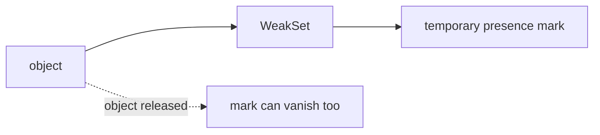

# SEC-02: WeakSet Patterns (The Temporary Marker)

> **"`WeakSet` cocok saat kita hanya perlu menandai objek tertentu tanpa perlu menyimpan daftar permanen yang bisa diiterasi."**

## Source Hub
- [MDN Web Docs - WeakSet](https://developer.mozilla.org/en-US/docs/Web/JavaScript/Reference/Global_Objects/WeakSet)
- [MDN Web Docs - Keyed collections](https://developer.mozilla.org/en-US/docs/Web/JavaScript/Guide/Keyed_collections)

## Formal Definition
`WeakSet` adalah koleksi objek unik yang referensinya bersifat lemah, sehingga objek tetap bisa dibersihkan saat tidak dipakai di tempat lain.

## Mental Model
Bayangkan `WeakSet` sebagai cap sementara pada unit fisik: cap itu berguna saat unit masih ada, tetapi tidak dimaksudkan menjadi daftar inventaris permanen.

## Mekanisme Praktis
- `WeakSet` hanya menerima objek.
- Ia cocok untuk menandai objek "sudah diproses", "sudah dilihat", atau "aktif sementara" tanpa membuat koleksi berat yang harus dirawat.

## Arsitek Mindset
- Gunakan `WeakSet` untuk status objek yang sifatnya sementara dan tidak perlu diiterasi massal.
- Hindari `WeakSet` jika Anda perlu melihat seluruh isi koleksi kapan saja.

## Lab Praktis
Eksperimen keunikan dan penandaan objek dapat mulai dari [set_lab.js](../examples/set_lab.js).

---
*Status: [status.md](../../../status.md)*
