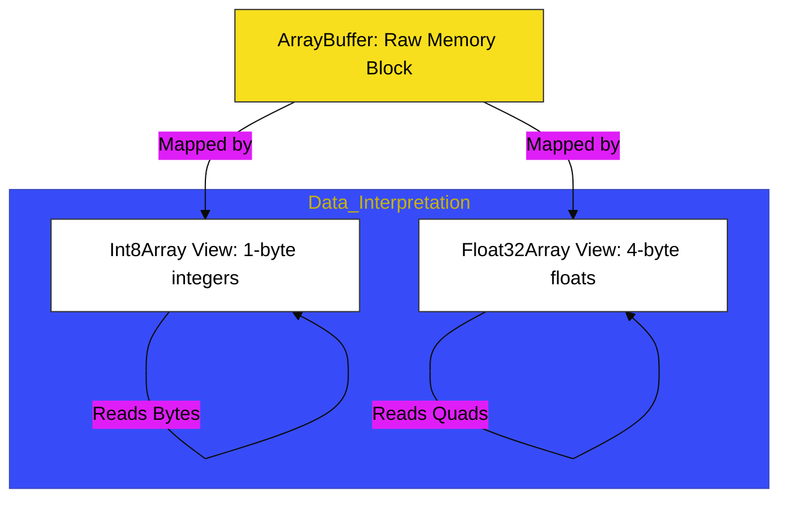

# CH-05: Typed Arrays

> **"Data Biner: Manipulasi Memori Mentah Melalui Buffer dan Views."**

---

## 🔗 Source Hub
- **Primary Source**: [MDN Web Docs - Typed arrays](https://developer.mozilla.org/en-US/docs/Web/JavaScript/Guide/Typed_arrays)
- **Technical Reference**: [ECMA-262 - Structured Data](https://tc39.es/ecma262/#sec-structured-data)
- **Conceptual Parent**: [BK-02 Collection Hubs](../README.md)

---

## 🌓 1. Essence: The Logic
Terkadang, aplikasi membutuhkan performa maksimal saat mengolah data biner mentah (seperti audio, video, atau data WebGL). **Typed Arrays** di **CH-05** membedah mekanisme internal penyediaan akses ke blok memori mentah melalui **ArrayBuffer** dan bagaimana **TypedArray Views** (seperti `Int8Array` atau `Float64Array`) memberikan interpretasi data yang presisi.

Memahami manipulasi biner ini memungkinkan Anda membangun Hub aplikasi yang mampu menangani beban kerja berat secara efisien, dengan kontrol langsung atas alokasi dan pembacaan memori.

---

## 🎨 2. Visual Logic: The Binary Buffer Mapping
Mekanisme pengaitan memori mentah ke interpretasi data berukuran tertentu:

---

## 🏛️ 3. Sections Atlas
- **[SEC-01: ArrayBuffer & Views](./SEC-01_ArrayBufferAndViews/)**: Membedah teknik alokasi blok memori mentah dan pemetaannya.
- **[SEC-02: TypedArray Use Cases](./SEC-02_TypedArrayUseCases/)**: Meninjau aplikasi praktis (Web Audio, Canvas, WebGL).
- **[SEC-03: DataView Utility](./SEC-02_TypedArrayUseCases/)**: Menjelaskan kontrol presisi atas urutan byte (*Endianness*) saat membaca buffer.

---

## 🧪 4. The Lab (Binary Lab)
Uji ketajaman alokasi dan pembacaan data biner di laboratorium:
- `../examples/typed_array_demo.js`

---

## ⚠️ 5. Common Pitfalls & Myths
- **Mitos**: *"Typed Array adalah array JavaScript biasa."* (Salah, Typed Array memiliki ukuran yang **Tetap** (*Fixed-length*) sejak awal alokasi dan hanya bisa menampung satu jenis tipe numerik tertentu, memberikan efisiensi yang jauh lebih tinggi daripada array standar).
- **Mitos**: *"Lakukan operasi array standar pada Typed Array."* (Faktanya, Typed Array tidak memiliki metode `.push()` atau `.pop()`; karena ukurannya terkunci, Anda harus memanipulasi isinya secara langsung melalui indeks atau `.set()`).

---
*Back to [Collection Hubs](../README.md)*
