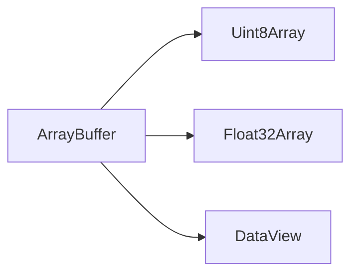

# SEC-01: ArrayBuffer and Views (The High-Speed Pipeline)

> **"Typed arrays dimulai dari satu ide sederhana: pisahkan kontainer memori dari cara kita melihat isi di dalamnya."**

## Source Hub
- [MDN Web Docs - ArrayBuffer](https://developer.mozilla.org/en-US/docs/Web/JavaScript/Reference/Global_Objects/ArrayBuffer)
- [MDN Web Docs - TypedArray](https://developer.mozilla.org/en-US/docs/Web/JavaScript/Reference/Global_Objects/TypedArray)
- [MDN Web Docs - DataView](https://developer.mozilla.org/en-US/docs/Web/JavaScript/Reference/Global_Objects/DataView)

## Formal Definition
`ArrayBuffer` adalah blok memori mentah, sedangkan typed arrays dan `DataView` adalah view untuk membaca atau menulis isi buffer tersebut.

## Mental Model
Bayangkan pipa data berkecepatan tinggi: buffer adalah tabungnya, view adalah lensa yang menentukan bagaimana isi di dalamnya dibaca.

## Mekanisme Praktis
- `ArrayBuffer` hanya memesan memori.
- View menentukan tipe pembacaan data.
- `DataView` cocok saat format binernya campuran dan butuh kontrol lebih detail.

## Arsitek Mindset
- Pahami dulu kebutuhan format datanya sebelum memilih jenis view.
- Jangan campur typed arrays dengan asumsi array biasa.

## Lab Praktis
Lihat pembentukan buffer dan view di [typed_arrays_lab.js](../examples/typed_arrays_lab.js).

---
*Status: [status.md](../../../status.md)*
