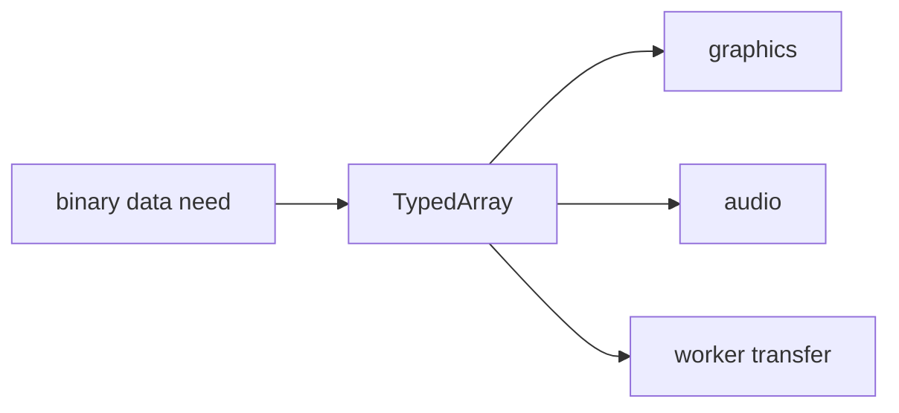

# SEC-02: TypedArray Use Cases (The Binary Channel)

> **"Typed arrays tidak ditujukan untuk semua masalah. Mereka bersinar saat data biner, performa tinggi, atau transfer memori menjadi kebutuhan nyata."**

## Source Hub
- [MDN Web Docs - TypedArray](https://developer.mozilla.org/en-US/docs/Web/JavaScript/Reference/Global_Objects/TypedArray)
- [MDN Web Docs - JavaScript typed arrays](https://developer.mozilla.org/en-US/docs/Web/JavaScript/Guide/Typed_arrays)

## Formal Definition
Typed arrays memberi JavaScript akses yang lebih terstruktur ke data numerik mentah dalam memori.

## Mental Model
Bayangkan saluran biner khusus yang hanya menerima data dengan ukuran dan tipe seragam.

## Mekanisme Praktis
- Cocok untuk WebGL, audio, file biner, atau interoperabilitas worker.
- Keuntungannya datang dari struktur data yang lebih ketat dan prediktif.

## Arsitek Mindset
- Pilih typed arrays karena kebutuhan teknis nyata, bukan karena terlihat lebih low-level.
- Dokumentasikan tipe data yang dipakai agar pembaca lain tidak menebak-nebak.

## Lab Praktis
Lihat contoh penggunaan di [typed_arrays_lab.js](../examples/typed_arrays_lab.js).

---
*Status: [status.md](../../../status.md)*
