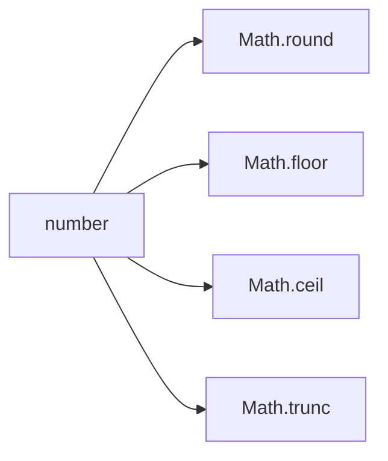

# SEC-01: Rounding Tools (The Calibration Bench)

> **"Pembulatan bukan satu tombol tunggal. JavaScript menyediakan beberapa alat berbeda, dan tiap alat punya perilaku yang perlu dipilih dengan sengaja."**

## Source Hub
- [MDN Web Docs - Math](https://developer.mozilla.org/en-US/docs/Web/JavaScript/Reference/Global_Objects/Math)
- [MDN Web Docs - Math.round()](https://developer.mozilla.org/en-US/docs/Web/JavaScript/Reference/Global_Objects/Math/round)

## Formal Definition
Metode pembulatan `Math` membantu menyesuaikan angka ke bentuk integer tertentu sesuai aturan masing-masing.

## Mental Model
Bayangkan bangku kalibrasi dengan empat alat: satu membulatkan ke terdekat, satu ke bawah, satu ke atas, dan satu hanya memotong desimal.

## Mekanisme Praktis
- `round()` ke terdekat
- `floor()` ke bawah
- `ceil()` ke atas
- `trunc()` buang desimal

## Arsitek Mindset
- Gunakan `trunc()` saat Anda ingin memotong, bukan membulatkan.
- Pilih alat berdasarkan semantik hasil yang diinginkan, bukan sekadar kebiasaan.

## Lab Praktis
Contoh rounding ada di [math_lab.js](../examples/math_lab.js).

---
*Status: [status.md](../../../status.md)*
