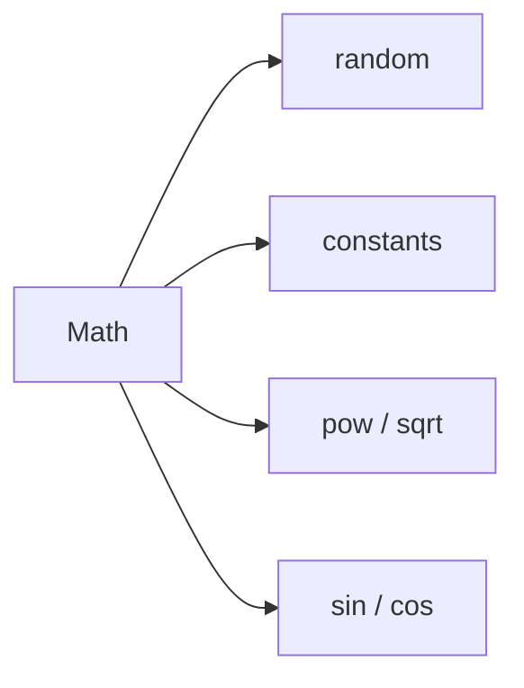

# SEC-02: Random and Utility Math (The Signal Simulator)

> **"`Math` juga menjadi sumber alat bantu umum, dari angka acak sampai konstanta dan fungsi geometri dasar."**

## Source Hub
- [MDN Web Docs - Math.random()](https://developer.mozilla.org/en-US/docs/Web/JavaScript/Reference/Global_Objects/Math/random)
- [MDN Web Docs - Math](https://developer.mozilla.org/en-US/docs/Web/JavaScript/Reference/Global_Objects/Math)

## Formal Definition
Bagian utility dari `Math` mencakup konstanta numerik dan fungsi bantu untuk randomisasi, trigonometri, akar, dan pangkat.

## Mental Model
Bayangkan `Math` sebagai simulator sinyal: satu rak menghasilkan nilai acak, rak lain menyediakan konstanta dan operasi teknik.



## Mekanisme Praktis
- `Math.random()` memberi nilai antara 0 dan 1.
- `Math.PI`, `Math.sqrt()`, `Math.pow()` dan rekan-rekannya membantu banyak perhitungan dasar.

```javascript
const flux = Math.floor(Math.random() * 100) + 1;
```

## Arsitek Mindset
- Untuk random yang perlu deterministik, jangan bergantung langsung pada `Math.random()`.
- Gunakan konstanta dan fungsi `Math` sebagai toolkit statis, bukan objek yang perlu diinstansiasi.

## Lab Praktis
Eksperimen random dan utilitas angka ada di [math_lab.js](../examples/math_lab.js).

---
*Status: [status.md](../../../status.md)*
