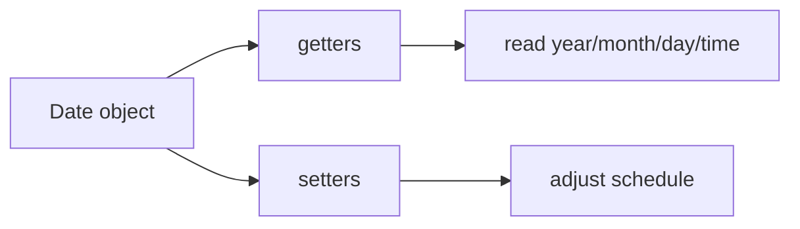

# SEC-01: Reading and Setting Time (The Chronometer Controls)

> **"`Date` menyediakan dua kelompok alat dasar: membaca bagian waktu, dan mengubahnya saat kita perlu menjadwalkan ulang sesuatu."**

## Source Hub
- [MDN Web Docs - Date](https://developer.mozilla.org/en-US/docs/Web/JavaScript/Reference/Global_Objects/Date)
- [MDN Web Docs - Date examples](https://developer.mozilla.org/en-US/docs/Web/JavaScript/Reference/Global_Objects/Date#examples)

## Formal Definition
Objek `Date` merepresentasikan satu titik waktu dan menyediakan getter/setter untuk membaca atau mengubah komponennya.

## Mental Model
Bayangkan `Date` sebagai panel kronometer dengan tombol baca dan tombol atur.

## Mekanisme Praktis
- Getter seperti `getFullYear()`, `getMonth()`, `getDate()`, dan `getTime()`
- Setter seperti `setMonth()` atau `setHours()`

## Arsitek Mindset
- Ingat bahwa `getMonth()` dimulai dari 0.
- Beri perhatian khusus saat Anda mengubah sebagian komponen waktu agar hasil akhir tetap masuk akal.

## Lab Praktis
Lihat manipulasi waktu dasar di [date_lab.js](../examples/date_lab.js).

---
*Status: [status.md](../../../status.md)*
