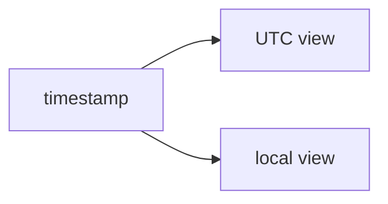

# SEC-02: UTC and Local Time (The Dual Clock)

> **"JavaScript sering bekerja dengan dua jam sekaligus: satu jam universal di belakang layar, satu jam lokal untuk ditampilkan ke pengguna."**

## Source Hub
- [MDN Web Docs - Date](https://developer.mozilla.org/en-US/docs/Web/JavaScript/Reference/Global_Objects/Date)
- [MDN Web Docs - Date.prototype.toISOString()](https://developer.mozilla.org/en-US/docs/Web/JavaScript/Reference/Global_Objects/Date/toISOString)

## Formal Definition
`Date` menyimpan titik waktu yang sama, tetapi dapat dibaca dalam konteks UTC maupun waktu lokal sistem.

## Mental Model
Bayangkan dua jam pada satu panel kontrol: jam UTC untuk sinkronisasi global, dan jam lokal untuk operator yang sedang melihat dashboard.

## Mekanisme Praktis
- `getTime()` untuk timestamp
- `toISOString()` untuk format UTC yang stabil
- getter lokal untuk tampilan yang dekat dengan pengguna

## Arsitek Mindset
- Hindari mencampur UTC dan lokal tanpa sadar.
- Gunakan UTC untuk penyimpanan dan transfer data antarsistem.

## Lab Praktis
Lihat latihan pembacaan waktu di [date_lab.js](../examples/date_lab.js).

---
*Status: [status.md](../../../status.md)*
