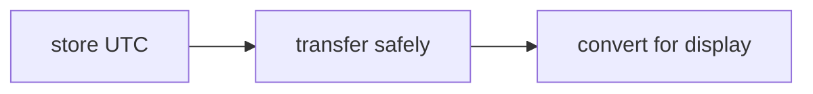

# SEC-03: Date Practices (The Safe Scheduling Rules)

> **"Masalah terbesar dengan waktu biasanya bukan API-nya, tetapi asumsi kita saat menyimpan, mengirim, dan menampilkan data waktu."**

## Source Hub
- [MDN Web Docs - Date](https://developer.mozilla.org/en-US/docs/Web/JavaScript/Reference/Global_Objects/Date)
- [MDN Web Docs - Representing dates and times](https://developer.mozilla.org/en-US/docs/Web/JavaScript/Guide/Representing_dates_times)

## Formal Definition
Praktik penggunaan `Date` yang aman berfokus pada konsistensi format, zona waktu, dan titik konversi.

## Mental Model
Bayangkan aturan penjadwalan aman: satu format untuk menyimpan, satu titik konversi untuk menampilkan.

## Mekanisme Praktis
- Simpan dan kirim waktu dalam format UTC saat memungkinkan.
- Lakukan konversi ke waktu lokal di lapisan presentasi.
- Dokumentasikan asumsi zona waktu jika sistem melayani banyak wilayah.

## Arsitek Mindset
- Timezone bugs sering muncul dari keputusan kecil yang tidak dicatat.
- Semakin dini Anda menata aturan waktu, semakin sedikit kebingungan di tahap integrasi.

## Lab Praktis
Contoh penjadwalan ada di [date_lab.js](../examples/date_lab.js).

---
*Status: [status.md](../../../status.md)*
