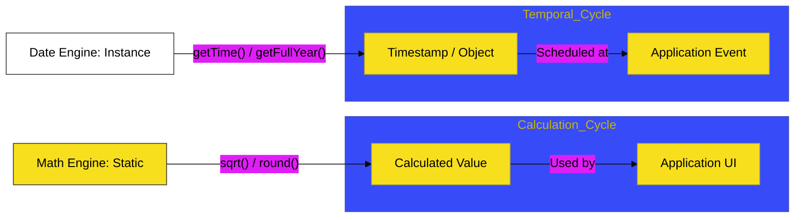

# CH-01: Math & Date

> **"Kalkulasi & Waktu: Membedah Mesin Presisi Numerik dan Manajemen Temporal."**

---

## 🔗 Source Hub
- **Primary Source**: [MDN Web Docs - Numbers and dates](https://developer.mozilla.org/en-US/docs/Web/JavaScript/Guide/Numbers_and_dates)
- **Technical Reference**: [ECMA-262 - The Math Object](https://tc39.es/ecma262/#sec-math-object)
- **Conceptual Parent**: [BK-03 Utility Engines](../README.md)

---

## 🌓 1. Essence: The Logic
Aplikasi modern memerlukan kemampuan untuk menghitung dan menjadwalkan aksi secara tepat. Di **CH-01**, kita membedah mekanisme internal **Math** (Objek Statis) untuk operasi trigonometri, pembulatan, dan kalkulasi kompleks, serta **Date** (Konstruktor) untuk mengelola stempel waktu (*timestamps*) dan zona waktu.

Memahami **Utility Engines** ini memungkinkan Anda membangun fitur Hub yang dinamis, mulai dari visualisasi data saintifik hingga sistem penjadwalan yang akurat secara waktu global.

---

## 🎨 2. Visual Logic: The Numeric & Temporal Flow
Mekanisme pengolahan angka kompleks dan alur transformasi waktu:

---

## 🏛️ 3. Sections Atlas
- **[SEC-01: Math Operations](./CH-01_MathDate/)**: Membedah teknik pembulatan dan kalkulasi trigonometri bawaan Objek Math.
- **[SEC-02: Date Instance](./CH-01_MathDate/)**: Meninjau pembuatan stempel waktu dan manipulasi objek Date.
- **[SEC-03: Temporal Formatting](./CH-01_MathDate/)**: Menjelaskan teknik tampilan waktu di berbagai zona waktu secara kinetik.

---

## 🧪 4. The Lab (Utility Lab)
Uji ketajaman kalkulasi dan ketepatan waktu di laboratorium:
- `../examples/math_date_demo.js`

---

## ⚠️ 5. Common Pitfalls & Myths
- **Mitos**: *"Objek Math harus diinstansiasi dengan `new Math()`."* (Salah, **Math** adalah objek statis yang tidak memiliki konstruktor. Anda bisa langsung memanggil metodenya tanpa perlu pembuatan instance baru).
- **Mitos**: *"JavaScript Date otomatis menangani zona waktu dengan sempurna."* (Faktanya, bekerja dengan `Date` bisa sangat menjebak karena ia secara default menggunakan zona waktu lokal pengguna. Arsitek Hub profesional sering kali menstandardisasi waktu ke **UTC** untuk menjaga integritas data lintas wilayah).

---
*Back to [Utility Engines](../README.md)*
