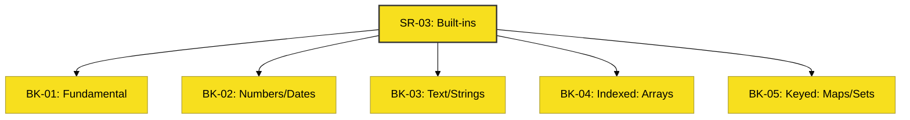

# SR-03: Built-ins (The Standard Toolkit)

> **"Toolkit Standar: Instrumen Bawaan untuk Mengolah Energi Data."**

---

## 🔗 Source Hub
- **Primary Source**: [MDN Web Docs - Global Objects](https://developer.mozilla.org/en-US/docs/Web/JavaScript/Reference/Global_Objects)
- **Technical Reference**: [ECMA-262 - Standard Built-in Objects](https://tc39.es/ecma262/#sec-standard-built-in-objects)
- **Conceptual Parent**: [RAK-02 Foundation](../README.md)

---

## 🌓 1. Essence: The Narrative
JavaScript tidak hanya memberikan sintaks, tetapi juga sekumpulan **Built-in Objects** yang siap pakai. Dalam arsitektur **Syntax Fuel**, built-ins adalah instrumen standar yang memproses tipe data spesifik—mulai dari memanipulasi angka dan waktu, hingga mengelola koleksi data kompleks melalui Array, Map, dan Set.

Penguasaan SR-03 adalah tentang memilih alat yang tepat untuk pekerjaan yang tepat, memastikan efisiensi memori dan kejelasan logika dalam sirkuit aplikasi Anda.

---

## 🗺️ 2. Landscape: The Big Picture
Ekosistem instrumen bawaan di SR-03 dibagi menjadi 5 kategori fungsional:

### 🎨 Visual Logic: The Global Toolkit Map

### 🏛️ Books Atlas
1.  **[BK-01: Fundamental Objects](./BK-01_FundamentalObjects/)**: Objek dasar (Object, Function, Boolean) yang menopang entitas lain.
2.  **[BK-02: Numbers & Dates](./BK-02_NumbersDates/)**: Instrumen numerik (Math, Number) dan manajemen waktu (Date).
3.  **[BK-03: Text Processing](./BK-03_TextProcessing/)**: Pengolahan string dan manipulasi teks.
4.  **[BK-04: Indexed Collections](./BK-04_IndexedCollections/)**: Koleksi berbasis indeks (Array, TypedArrays).
5.  **[BK-05: Keyed Collections](./BK-05_KeyedCollections/)**: Koleksi berbasis kunci (Map, Set, WeakMap).

---

## 🧪 3. The Lab (Toolkit Proof)
Setiap buku dilengkapi dengan folder `examples/` untuk memverifikasi performa metode bawaan (seperti `Array.map` vs `for loop`) dan perilaku objek fundamental.

---

## ⚠️ 4. Common Pitfalls & Myths
- **Mitos**: *"Primitive values adalah Object."* (Faktanya, primitives seperti string bukan object, namun JavaScript secara otomatis "membungkusnya" dalam object sementara saat Anda memanggil metode padanya).
- **Mitos**: *"Map selalu lebih lambat dari Object biasa."* (Faktanya, untuk penambahan/penghapusan data yang sangat intensif, Map seringkali jauh lebih efisien daripada Object biasa).

---
*Status: [x] Complete. Struktur dan Visual telah diselaraskan ke Adaptive Gold Standard.*
