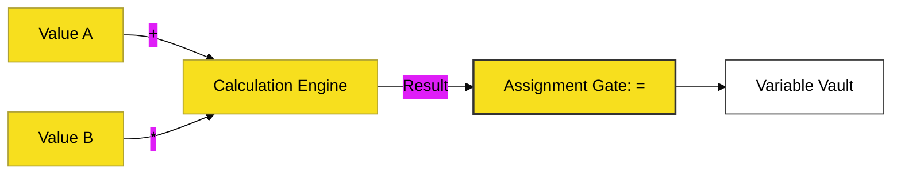

# CH-01: Basic Arithmetic & Assignment

> **"Alokasi & Kalkulasi: Mengatur Pipa Input dan Transformasi Energi Dasar."**

---

## 🔗 Source Hub
- **Primary Source**: [MDN Web Docs - Arithmetic Operators](https://developer.mozilla.org/en-US/docs/Web/JavaScript/Reference/Operators/Arithmetic_Operators)
- **Technical Reference**: [ECMA-262 - Arithmetic Operators](https://tc39.es/ecma262/#sec-arithmetic-operators)
- **Conceptual Parent**: [BK-01 Basic Operators](../README.md)

---

## 🌓 1. Essence: The Logic
**CH-01** membedah dua instrumen paling fundamental dalam manipulasi data:
1.  **Arithmetic Operators**: Transformasi nilai melalui kalkulasi matematis (Tambah, Kurangi, dsb).
2.  **Assignment Operators**: Gerbang penyimpanan yang menyalurkan hasil kalkulasi ke dalam variabel/brankas memori.

Di sini, kita tidak hanya belajar "+", "-", "*" tapi bagaimana operator penugasan gabungan (seperti `+=`) mengoptimalkan penulisan alur energi di dalam sirkuit program.

---

## 🎨 2. Visual Logic: The Calculation Flow
Mekanisme pengolahan dan penyimpanan nilai:

---

## 🏛️ 3. Sections Atlas
- **[SEC-01: Arithmetic](./SEC-01_Arithmetic/)**: Membedah instrumen kalkulasi dasar dan eksponensial.
- **[SEC-02: Assignment](./SEC-02_Assignment/)**: Membedah teknik pengisian daya dan *shorthand assignment*.

---

## 🧪 4. The Lab (Arithmetic Lab)
Buktikan bagaimana urutan kalkulasi (precedence) bekerja melalui laboratorium di:
- `../examples/arithmetic_lab.js`

---

## ⚠️ 5. Common Pitfalls & Myths
- **Mitos**: *"Operator `+` selalu berfungsi sebagai penjumlahan matematis."* (Salah, pada JavaScript, `+` juga berfungsi sebagai **String Concatenation** jika salah satu operand-nya adalah teks, yang bisa menyebabkan kebocoran logika).
- **Mitos**: *"Operator `**` hanyalah cara lain menulis `Math.pow()`."* (Benar secara fungsional, namun `**` adalah sintaks modern ES2016 yang lebih bersih dan efisien untuk operasi eksponensial).

---
*Back to [Basic Operators](../README.md)*
