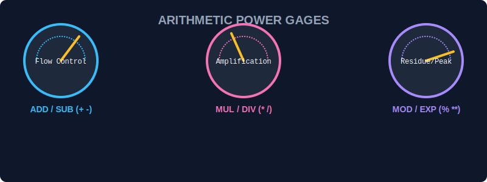

# SEC-01: Arithmetic Operators (The Power Gages)

> **"Setiap unit di Hub Energi membutuhkan perhitungan yang presisi. Arithmetic Operators adalah panel pengukur tenaga yang memungkinkan Anda menambah, mengurangi, membagi, dan melipatgandakan muatan energi yang mengalir melalui sirkuit."**

Operator aritmatika mengambil nilai numerik sebagai operand dan mengembalikan satu nilai numerik.

## 1. Mental Model: "The Power Gages"

Bayangkan Anda berada di ruang kendali utama. Anda memiliki tuas dan tombol untuk memanipulasi aliran tenaga:
- **`+` (Addition)**: Menggabungkan dua aliran tenaga.
- **`-` (Subtraction)**: Mengurangi beban dari sirkuit.
- **`*` (Multiplication)**: Melipatgandakan output energi.
- **`/` (Division)**: Membagi muatan ke beberapa saluran.
- **`%` (Remainder)**: Mencari sisa energi yang tidak terserap setelah pembagian.
- **`**` (Exponentiation)**: Meningkatkan tenaga secara eksponensial.



---

## 2. Increment & Decrement: Penyesuaian Halus

Seringkali kita hanya perlu menaikkan atau menurunkan energi sebanyak 1 unit.
- **`++` (Increment)**: Menambah 1.
- **`--` (Decrement)**: Mengurangi 1.

### Perbedaan Posisi (Prefix vs Postfix):
- **Postfix (`x++`)**: Gunakan nilai saat ini dulu, baru tingkatkan energinya.
- **Prefix (`++x`)**: Tingkatkan energi dulu, baru gunakan nilainya.

```javascript
let power = 10;
console.log(power++); // 10 (Gunakan dulu)
console.log(power);   // 11 (Telah naik)

let voltage = 10;
console.log(++voltage); // 11 (Naikkan dulu)
```

---

## Arsitek Mindset: Hierarki Operasi

Sama seperti sirkuit fisik, operator memiliki urutan prioritas (Precedence). Perkalian (`*`) dan Pembagian (`/`) selalu diproses lebih dulu daripada Penjumlahan (`+`) dan Pengurangan (`-`). Gunakan kurung `()` untuk memastikan aliran energi mengalir sesuai desain Anda!

---

## Hands-on: Lab Pengukur Tenaga
Buka file `examples/arithmetic_lab.js` untuk mensimulasikan perhitungan beban energi dan penyesuaian halus pada sistem kontrol Hub.

---
*Status: [status.md](../../../status.md)*
