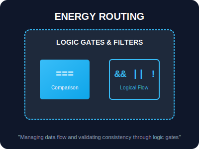

# BK-01: Energy Flow (Logic Gates)

> **"Sinyal energi yang mengalir di Hub harus diproses dan dialokasikan dengan tepat. BK-01 membahas unit-unit dasar yang menangani perhitungan tenaga dan penyaringan aliran melalui gerbang logika."**

## 1. Alat Operasional

### A. Arithmetic (The Power Units)
Mengatur besaran energi yang mengalir.
- `+` (Addition): Penggabungan aliran.
- `**` (Exponentiation): Multiplikasi energi secara eksponensial.

### B. Comparison (The Balance Scales)
Memastikan dua aliran energi memiliki tekanan atau besaran yang sama.
- `===` (Strict Equality): Pengecekan identitas total (Nilai + Tipe).
- `!==` (Strict Inequality): Memastikan sirkuit berbeda.

### C. Logical (The Routing Valves)
Menentukan jalur mana yang akan dibuka.
- `&&` (AND): Kedua sirkuit harus aktif.
- `||` (OR): Salah satu sirkuit aktif sudah cukup.
- `??` (Nullish): Menyediakan energi cadangan hanya jika sirkuit utama kosong (`null`/`undefined`).

---

## 2. Visualisasi: Logic Gates

---

## Hands-on: Lab Routing Logika
Eksperimen dengan penyaringan data dan nilai default di `examples/routing_logic_lab.js`.
