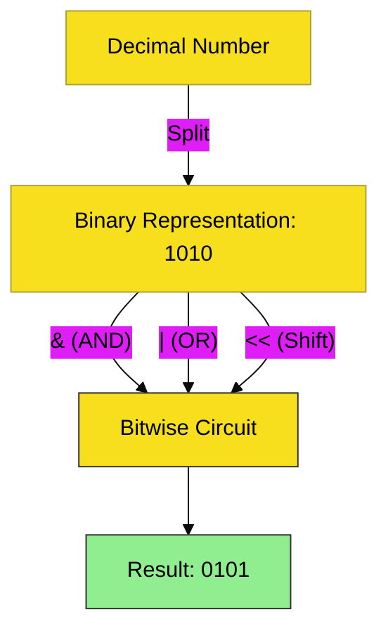

# CH-01: Bitwise Operations

> **"Sirkuit Sub-Atomik: Manipulasi Nilai di Tingkat Bit Mentah."**

---

## 🔗 Source Hub
- **Primary Source**: [MDN Web Docs - Bitwise Operators](https://developer.mozilla.org/en-US/docs/Web/JavaScript/Reference/Operators/Bitwise_Operators)
- **Technical Reference**: [ECMA-262 - Bitwise Shift Operators](https://tc39.es/ecma262/#sec-bitwise-shift-operators)
- **Conceptual Parent**: [BK-02 Bitwise & Ternary](../README.md)

---

## 🌓 1. Essence: The Logic
**Bitwise Operators** adalah instrumen manipulasi data di tingkat yang paling rendah: biner (0 dan 1). Alih-alih melihat angka sebagai desimal (seperti `10`), operator ini membelah angka menjadi representasi bit 32-bit-nya.

Ini adalah "Senjata Rahasia" arsitek sistem untuk optimasi performa ekstrem, manajemen *flags* (izin akses), dan pemrosesan grafis/sinyal di dalam sirkuit program.

---

## 🎨 2. Visual Logic: The Bitwise Logic Flow
Mekanisme pemrosesan data biner:

---

## 🏛️ 3. Sections Atlas
- **[SEC-01: Bitwise Circuits](./SEC-01_Bitwise/)**: Membedah logika gerbang `AND`, `OR`, `XOR`, `NOT`, dan operator penggeseran bit (*Bitwise Shifts*).

---

## 🧪 4. The Lab (Bitwise Lab)
Uji kecepatan dan logika manipulasi biner Anda melalui laboratorium di:
- `../examples/bitwise_logic_lab.js`

---

## ⚠️ 5. Common Pitfalls & Myths
- **Mitos**: *"Bitwise di JavaScript bekerja pada angka 64-bit."* (Salah, JavaScript mengonversi operan menjadi **Signed 32-bit Integers** sebelum melakukan operasi Bitwise).
- **Mitos**: *"Bitwise hanya untuk hacker sistem."* (Faktanya, ini sangat berguna untuk manipulasi warna (RGB), kompresi data sederhana, dan pengelolaan ribuan status (*state*) hanya dalam satu variabel angka).

---
*Back to [Bitwise & Ternary](../README.md)*
