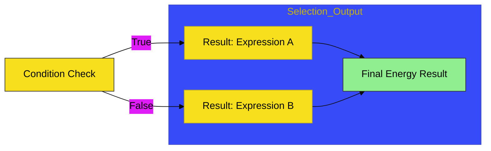

# CH-02: Ternary & Nullish

> **"Penyaluran Selektif: Alur Percabangan Ekspresi yang Ringkas dan Aman."**

---

## 🔗 Source Hub
- **Primary Source**: [MDN Web Docs - Conditional (Ternary) Operator](https://developer.mozilla.org/en-US/docs/Web/JavaScript/Reference/Operators/Conditional_Operator)
- **Technical Reference**: [ECMA-262 - Conditional Operator](https://tc39.es/ecma262/#sec-conditional-operator)
- **Conceptual Parent**: [BK-02 Bitwise & Ternary](../README.md)

---

## 🌓 1. Essence: The Logic
**Ternary & Nullish Operators** adalah instrumen pengambil keputusan di tingkat ekspresi tunggal. Berbeda dengan `if-else` (Statement) yang melakukan blok aksi, operator ini memilih jalur mana yang akan dikirimkan sebagai **hasil** operasional grid.

- **Ternary (`condition ? val1 : val2`)**: Pipa dua jalur berdasarkan kebenaran kondisi.
- **Nullish Coalescing (`??`)**: Katup pengaman untuk menangani ketiadaan data (`null/undefined`) tanpa mengganggu nilai *falsy* yang sah (seperti `0` atau `""`).

---

## 🎨 2. Visual Logic: The Ternary Choice Flow
Mekanisme pengolahan pemilihan jalur ekspresi:

---

## 🏛️ 3. Sections Atlas
- **[SEC-01: Branching & Sequencing](./SEC-01_BranchingSequencing/)**: Membedah teknik percabangan ekspresi singkat dan penggunaan operator koma.

---

## 🧪 4. The Lab (Selection Lab)
Buktikan bagaimana urutan evaluasi dan penanganan `null` bekerja melalui laboratorium di:
- `../examples/ternary_nullish_lab.js`

---

## ⚠️ 5. Common Pitfalls & Myths
- **Mitos**: *"Ternary bisa menggantikan semua `if-else`."* (Salah, hindari *nested ternary* (ternary bertingkat) karena hal itu akan membuat alur sirkuit Anda sangat sulit dibaca).
- **Mitos**: *"Operator Nullish (`??`) itu sama dengan Logical OR (`||`)."* (Sama sekali berbeda; `??` hanya aktif jika nilainya benar-benar kosong (`null/undefined`), sedangkan `||` aktif pada semua nilai *falsy* seperti `0`).

---
*Back to [Bitwise & Ternary](../README.md)*
