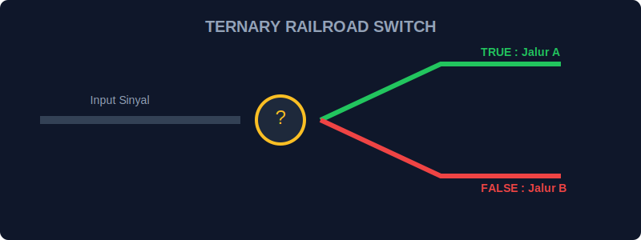
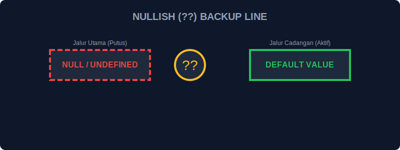

# SEC-01: Branching & Sequencing (Selective Routing)

> **"Terkadang aliran energi tidak butuh gerbang logika yang berat. Kita butuh percabangan cepat di persimpangan jalan atau pengurutan beberapa perintah dalam satu jalur. Selective Routing adalah kuncinya."**

Bab ini membahas operator yang membantu mengatur aliran eksekusi secara ringkas.

## 1. Operator Ternary: "The Quick Switch"

`condition ? valueIfTrue : valueIfFalse`

Ternary adalah jalur pintas untuk `if...else`. Bayangkan sebuah saklar otomatis di persimpangan: Jika sinyal sensor AKTIF, belok ke Kanan; jika MATI, belok ke Kiri.



```javascript
const status = voltage > 220 ? "DANGER" : "SAFE";
```

---

## 2. Nullish Coalescing (`??`): "The Backup Line"

Operator ini memastikan aliran energi tetap mengalir meskipun sumber utama kosong (`null` atau `undefined`). Jalur cadangan hanya digunakan jika jalur utama benar-benar "putus".



---

## 3. Comma Operator (`,`): "The Step Sequence"

Operator koma mengevaluasi setiap operand (dari kiri ke kanan) dan mengembalikan hasil dari operand terakhir. Ini seperti rangkaian instruksi yang dilakukan secara berurutan dalam satu detak jam.

```javascript
let x = (energy++, 10); 
// energy ditingkatkan, tapi nilai x yang disimpan adalah 10.
```

---

## Arsitek Mindset: Keterbacaan Jalur
Hanya karena Anda *bisa* menulis logika dalam satu baris menggunakan ternary atau koma, bukan berarti Anda *harus* melakukannya. Prioritaskan keterbacaan (Readability). Sirkuit yang terlalu padat dan rumit akan sulit diperbaiki oleh arsitek lain di masa depan.

---

## Hands-on: Lab Rute Selektif
Buka file `examples/selective_routing_lab.js` untuk mempraktikkan penulisan logika yang efisien menggunakan rute percabangan cepat dan operator penggabungan nullish.

---
*Status: [status.md](../../../status.md)*
