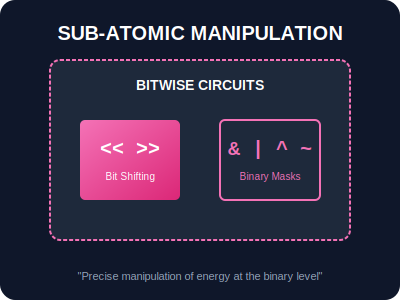

# BK-02: Advanced Processing (Sub-atomic Circuits)

> **"Beberapa tugas di Hub membutuhkan kecepatan ekstrem. BK-02 membahas manipulasi data di level bit mentah dan pengambilan keputusan instan melalui sirkuit ternari."**

## 1. Alat Operasional

### A. Bitwise Operators (The Core Sifters)
Memanipulasi representasi biner 32-bit dari data.
- `&` (AND): Hanya bit yang sama-sama aktif yang diteruskan.
- `|` (OR): Bit yang aktif di salah satu sirkuit akan diteruskan.
- `^` (XOR): Bit yang berbeda di kedua sirkuit akan diteruskan.
- `~` (NOT): Membalikkan seluruh bit sirkuit.
- `<<`, `>>`: Menggeser bit ke kiri atau kanan (mengalikan/membagi dengan 2^n).

### B. Conditional Operator (The Instant Router)
`condition ? valueIfTrue : valueIfFalse`
Sirkuit keputusan satu baris yang sangat efisien untuk tugas-tugas sederhana.

---

## 2. Visualisasi: Bitwise Circuits

---

## Hands-on: Lab Sub-atomik
Eksperimen dengan Bitwise Masking dan routing cepat di `examples/bitwise_masking_lab.js`.
