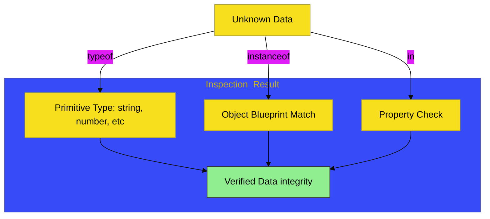

# CH-01: Relational & Unary

> **"Inspeksi & Intervensi: Menguji Integritas dan Hubungan Antar Data."**

---

## 🔗 Source Hub
- **Primary Source**: [MDN Web Docs - Unary Operators](https://developer.mozilla.org/en-US/docs/Web/JavaScript/Guide/Expressions_and_Operators#unary_operators)
- **Technical Reference**: [ECMA-262 - Relational Operators](https://tc39.es/ecma262/#sec-relational-operators)
- **Conceptual Parent**: [BK-03 Relational & Unary](../README.md)

---

## 🌓 1. Essence: The Logic
**Relational & Unary Operators** adalah instrumen inspeksi dan intervensi langsung terhadap muatan data. Jika operator lain berfokus pada kalkulasi, di sini kita berfokus pada **Verifikasi Status** (Tipe apa ini? Apakah milik objek ini?) dan **Penghapusan Data**.

- **Unary (`typeof`, `delete`, `void`)**: Tindakan langsung pada satu operand untuk mengetahui tipe atau menghapus referensi.
- **Relational (`in`, `instanceof`)**: Menguji hubungan antar objek dan keberadaan properti di dalam sirkuit.

---

## 🎨 2. Visual Logic: The Type Inspection Flow
Mekanisme verifikasi dan inspeksi tipe data:

---

## 🏛️ 3. Sections Atlas
- **[SEC-01: Unary Operations](./SEC-01_Unary/)**: Membedah instrumen inspeksi tipe (`typeof`) dan penghapusan sirkuit (`delete`).
- **[SEC-02: Relational Operations](./SEC-02_Relational/)**: Membedah pengujian hubungan objek (`instanceof`) dan keberadaan properti (`in`).

---

## 🧪 4. The Lab (Inspection Lab)
Uji ketepatan inspeksi tipe dan penghapusan data melalui laboratorium di:
- `../examples/inspection_lab.js`

---

## ⚠️ 5. Common Pitfalls & Myths
- **Mitos**: *"Operator `delete` menghapus objek dari memori secara permanen."* (Salah, `delete` hanya menghapus properti dari objek; objek itu sendiri akan dihapus oleh *Garbage Collector* hanya jika tidak ada referensi lain yang tersisa).
- **Mitos**: *"Operator `typeof` selalu akurat untuk semua objek."* (Salah, `typeof null` akan mengembalikan `"object"`, yang merupakan bug historis JavaScript yang harus selalu diingat oleh arsitek Hub).

---
*Back to [Relational & Unary](../README.md)*
