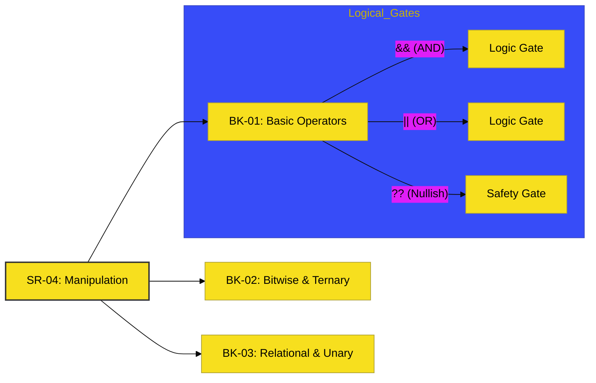

# SR-04: Expressions & Operators

> **"Pusat Manipulasi: Katup, Penyambung, dan Transformasi Energi Data."**

---

## 🔗 Source Hub
- **Primary Source**: [MDN Web Docs - Expressions and Operators](https://developer.mozilla.org/en-US/docs/Web/JavaScript/Guide/Expressions_and_Operators)
- **Technical Reference**: [ECMA-262 - Expressions](https://tc39.es/ecma262/#sec-ecmascript-language-expressions)
- **Conceptual Parent**: [RAK-02 Foundation](../README.md)

---

## 🌓 1. Essence: The Narrative
Dalam arsitektur JavaScript, data tidak pernah statis. Ia selalu bergerak (**Expressions**) dan diproses melalui **Operators**. Jika objek adalah mesin, maka operator adalah katup dan penyambung yang menentukan bagaimana energi data tersebut mengalir, dibandingkan, atau ditransformasi di level sub-atomik (bit).

Penguasaan SR-04 adalah tentang **Presisi Manipulasi**. Kesalahan kecil pada pemilihan operator (misalnya `==` vs `===`) dapat menyebabkan kebocoran logika yang sulit dideteksi di dalam Grid aplikasi Anda.

---

## 🗺️ 2. Landscape: The Big Picture
Sub-Rak ini membagi manipulasi energi menjadi tiga tingkatan presisi:

### 🎨 Visual Logic: The Manipulation Gatway

### 🏛️ Books Atlas
1.  **[BK-01: Basic Operators](./BK-01_BasicOperators/)**: Berfokus pada alokasi (Assignment), perhitungan (Arithmetic), perbandingan (Comparison), dan routing logika dasar.
2.  **[BK-02: Bitwise & Ternary](./BK-02_BitwiseTernary/)**: Manipulasi data di level bit mentah untuk performa ekstrem dan percabangan ekspresi singkat.
3.  **[BK-03: Relational & Unary](./BK-03_RelationalUnary/)**: Instrumen inspeksi sirkuit untuk memeriksa tipe data, keberadaan properti, dan penghapusan data.

---

## 🧪 3. The Lab (Manipulation Lab)
Eksperimen di folder `examples/` untuk membuktikan perbedaan performa antara operator logika dan melihat bagaimana **Bitwise** mengolah data biner secara langsung.

---

## ⚠️ 4. Common Pitfalls & Myths
- **Mitos**: *"Short-circuit evaluation (`&&` / `||`) hanyalah trik koding."* (Faktanya, ini adalah mekanisme efisiensi Hub yang menghentikan aliran energi lebih awal jika kondisi tidak terpenuhi).
- **Mitos**: *"Operator Nullish (`??`) sama dengan OR (`||`)."* (Sama sekali berbeda; `??` hanya menangani `null` atau `undefined`, sementara `||` bereaksi terhadap semua nilai *falsy* seperti `0` atau `""`).

---
*Status: [x] Complete. Terminologi dan Visual telah dinormalisasi.*
