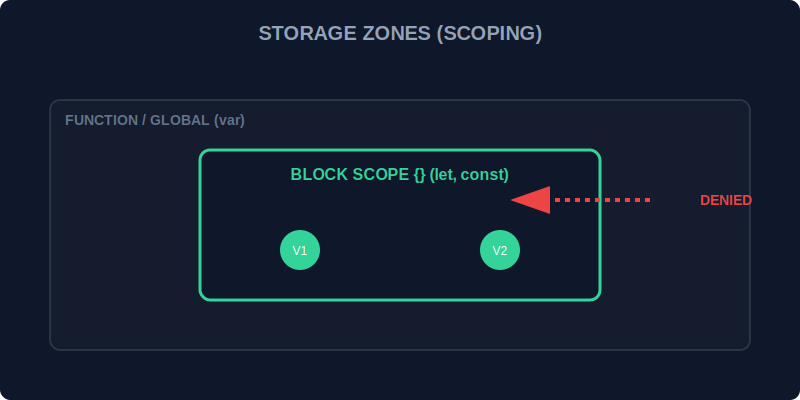

# SEC-01: Scoping & Initialization (The Storage Zones)

> **"Di dalam Hub Energi, cara Anda menyimpan energi (variabel) sama pentingnya dengan energi itu sendiri. Ada 'Zona Penyimpanan' yang bersifat publik dan ada yang sangat personal. Memilih antara `var`, `let`, atau `const` menentukan seberapa aman energi tersebut disimpan."**

Deklarasi variabel adalah proses memesan "slot" di memori Hub untuk menyimpan informasi.

## 1. Mental Model: "The Storage Zones"

Bayangkan Hub memiliki dua jenis ruangan:
- **`var` (The Open Lobby)**: Energinya tumpah ke luar ruangan (Function Scope). Ia bisa digunakan bahkan sebelum diletakkan (Hoisting) tapi isinya berupa `undefined`.
- **`let` & `const` (The Secure Safe)**: Energinya hanya ada di dalam kotak tersebut (Block Scope `{}`). Selama Anda belum sampai di kotak itu, Anda dilarang keras mencoba mengambilnya (**Temporal Dead Zone**).

---

## 2. Let vs Const: Dinamis vs Permanen

Dalam zona aman (Block Scope):
- **`let`**: Baterai yang bisa diisi ulang. Nilainya bisa diubah-ubah sesuai kebutuhan.
- **`const`**: Power Cell permanen. Begitu sudah terisi energi, isinya tidak boleh diganti (tapi jika isinya adalah objek, properti di dalamnya masih bisa dimodifikasi).

---

## 3. Mengapa Menghindari `var`?

Dalam kode modern, `var` lebih jarang dipilih karena semantics-nya berbeda dari `let` dan `const`: ia memakai function scope, mengizinkan re-declaration, dan sering membuat intent kode lebih sulit dibaca. Memahaminya tetap penting, terutama saat membaca kode lama atau menjelaskan perilaku hoisting di JavaScript.

---

## Arsitek Mindset: Prinsip Hak Akses Terendah

Sebagai arsitek memori:
1.  Gunakan **`const`** secara default. Jika data tidak perlu berubah, kunci dia secara permanen.
2.  Gunakan **`let`** hanya jika Anda tahu pasti nilai baterai tersebut akan berganti (misal: di dalam Loop).
3.  Pahami **`var`** sebagai bagian dari sejarah dan semantics JavaScript, tetapi pilihlah dengan sadar hanya saat Anda benar-benar membutuhkan perilakunya.

---

## Hands-on: Lab Zona Penyimpanan
Buka file `examples/scoping_lab.js` untuk melihat demonstrasi langsung bagaimana `let` dan `const` melindungi data agar tidak bocor keluar dari blok kode `{}`.

---
*Status: [status.md](../../../status.md)*
