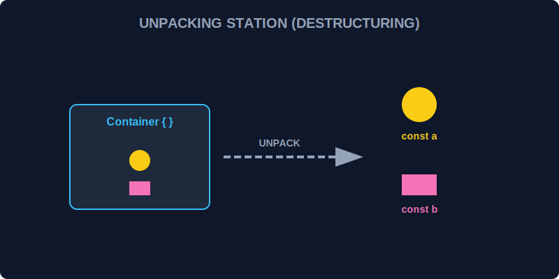

# SEC-02: Destructuring Assignment (The Unpacking Station)

> **"Terkadang, energi yang datang ke Hub terbungkus dalam paket besar (Array) atau peti kontainer (Object). Destructuring adalah 'Stasiun Pembongkaran' (Unpacking Station) yang memungkinkan Anda mengambil komponen yang Anda butuhkan secara langsung tanpa harus membongkar seluruh isi peti."**

Destructuring adalah sintaks khusus yang memungkinkan kita mengambil nilai dari array atau properti dari objek ke binding yang berbeda secara ringkas.

## 1. Mental Model: "The Unpacking Station"

Bayangkan sebuah kontainer besar berlabel `Data_Sektor_A`. Di dalamnya ada sensor suhu, tekanan, dan status. Tanpa destructuring, Anda harus membuka pintu, mencari sensor suhu, mengambilnya, lalu mencari sensor tekanan. Dengan destructuring, Anda cukup berkata: "Bongkar kontainer ini, ambilkan sensor suhu dan tekanan, letakkan di meja kerja saya."



---

## 2. Object Destructuring (Unpacking Box)

Ini digunakan untuk mengambil properti dari sebuah objek berdasarkan nama kuncinya (key).

```javascript
const hubConfig = { id: "G-99", battery: 80, status: "Active" };

// Destructuring: Mengambil id dan battery langsung
const { id, battery } = hubConfig;

console.log(`Bekerja di Hub: ${id} dengan Baterai: ${battery}%`);
```

---

## 3. Array Destructuring (Unpacking Sequence)

Ini digunakan untuk mengambil elemen dari array berdasarkan urutan posisinya.

```javascript
const coordinates = [10.5, 45.3];

// Destructuring: Mengambil elemen pertama (long) dan kedua (lat)
const [longitude, latitude] = coordinates;

console.log(`Koordinat Hub: ${longitude}, ${latitude}`);
```

---

## Arsitek Mindset: Membersihkan Sirkuit

Sebagai arsitek Hub:
- Gunakan destructuring pada parameter fungsi atau hasil pemanggilan API saat bentuk data sudah jelas dan stabil.
- Gunakan nilai default (`const { id = "Unknown" } = data`) untuk menjaga alur tetap aman saat properti yang diharapkan tidak tersedia.

---

## Hands-on: Lab Pembongkaran Data
Buka file `examples/destructuring_lab.js` untuk melihat bagaimana kita mengolah paket data sensor yang kompleks menggunakan teknik pembongkaran cepat ini.

---
*Status: [status.md](../../../status.md)*
